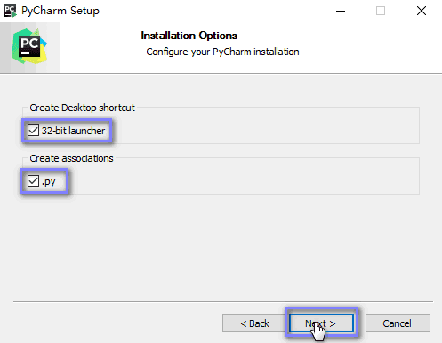
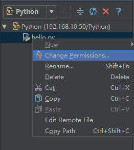

```python
import random
num = random.randint(1,10)

print('*' * 20)
print('猜数字游戏')
print('*' * 20)
print(num)
n = 0
while n < 3:
    ask = input("请输入一个数字\n")
    ask = int(ask)
    if n == 0 or n == 1:
        if num == ask:
            print("第{}次就对了，很棒".format(n+1))
            break
        elif num > ask:
            print("小了")
        elif num < ask:
            print("大了")
        n += 1
    elif n == 2:
        if num == ask:
            print("第{}次才对，一般般".format(n+1))
            break
        else:
            a = input("输入Y再次进行游戏 ：")
            if a == 'Y' or a == 'y':
                n = 0
```


## 八、PyCharm 的安装和使用

### 1、Pycharm 安装

以下是PyCharm在win10的64位系统安装实例的详细的图文步骤


#### 1、搭建环境

1、win10_X64，其他Win版本也可以。

2、PyCharm版本：Professional-2016.2.3。

#### 2、搭建准备

1、到[PyCharm官网](https://www.jetbrains.com/pycharm/)下载PyCharm安装包。


2、选择Windows系统的专业版下载。


安装软件

1、双击安装包进行安装。


2、自定义软件安装路径(建议路径中不要中文字符)。


3、创建桌面快捷方式并关联*.py文件。



4、选择开始菜单文件夹(默认即可)，点击安装。


5、耐心等待安装。


6、安装完成，勾选立即运行PyCharm。


7、选择是否导入开发环境配置文件，我们选择不导入。


8、阅读协议并同意。


9、修改hosts文件：C:\Windows\System32\drivers\etc\hosts；

0.0.0.0 account.jetbrains.com

10、选择输入激活码激活软件(请阅读下一步获取激活码)。


11、软件激活方式

1、推荐购买正版软件。

2、可以选择下载社区版本，免费的。

3、专业版本可以选择试用，免费试用30天。

4、网上寻找激活码或授权服务器。

我们使用第4种方法：

在[IntelliJ IDEA 注册码](http://idea.lanyus.com/)网站，获取激活码，以前允许自定义用户名，现在已经是No了，只能直接获取激活码


点击获取激活码后，文本默认是全选中的，直接右击选择复制即可。


12、将激活码粘贴到文本框，点击OK即可。


13、PyCharm的欢迎界面。


14、选择IDE主题与编辑区主题，建议Darcula主题(温馨提示：黑色更有利于保护眼睛噢!!!)。


15、由于我们更改主题，故会提示重启IDE，选择Yes。


16、选择创建新项目。


17、自定义项目存储路径，IDE默认会关联Python解释器。


18、IDE提供的提示，我选择在启动时不显示提示。


#### 3、编程字体（附加课余研究）

编程最常见的是什么？(肯定不是Bug)，而是代码了，绝大部分人都一直使用编辑器默认的字体，其实，换一套适合自己的编程字体不仅能让代码看得更舒服，甚至还能提高工作效率的！

那么如何选择编程字体呢？What!!!

1、等宽字体。

2、有辨识度，即0与O，1与l的区别。

推荐一款编程字体Hack，进入[Hack官网](http://sourcefoundry.org/hack/)，点击Download。


选择适合Windows系统的软件包下载。


进入GitHub下载安装程序。


下载完成的安装包，双击安装即可。


#### 4、配置IDE（附加课余研究）

1、显示/隐藏功能侧边栏(软件的左下角)。


2、显示项目目录结构。


3、配置IDE，按照下图，进入Settings。


4、设置显示行号，显示空白字符。


5、设置编程字体为Hack，字体大小为15。


6、设置控制台字体为Hack，字体大小为15。


7、修改新建*.py文件的模版，首行添加默认解释器(方便在Linux运行)，添加文件编码。


8、设置Python默认解释器，添加额外的扩展包，


#### 5、常用快捷键（附加课余研究）

1、Ctrl + Enter：在下方新建行但不移动光标；
**2、Shift + Enter：在下方新建行并移到新行行首；**
**3、Ctrl + /：注释(取消注释)选择的行；**
**4、Ctrl + Alt + L：格式化代码(与QQ锁定热键冲突，关闭QQ的热键)；**
5、Ctrl + Shift + +：展开所有的代码块；
6、Ctrl + Shift + -：收缩所有的代码块；
7、Ctrl + Alt + I：自动缩进行；
8、Alt + Enter：优化代码，添加包；
9、Ctrl + Shift + F：高级查找；
10、Alt + Shift + Q：更新代码到远程服务器；

#### 6、远程连接编程

有时我们需要在Windows上编写代码，在Linux运行代码，或着是团队合作开发项目，我们就需要远程连接Linux服务器进行编程。

在这里我使用虚拟机为远程服务器，虚拟机IP地址：192.168.10.50，使用XShell(ssh协议)连接服务器(虚拟机)，使用PyCharm(sftp协议)连接服务器(虚拟机)。

1、在XShell上查看虚拟机IP地址。


2、在虚拟机上创建项目工作空间。


3、在PyCharm上配置远程服务器。


4、添加新连接。


5、设置连接名称及使用的协议类型。


6、设置主机IP地址，工作空间(之前已创建)，登录信息。


7、浏览远程服务器。


8、在服务器上新建文件。


9、编写代码。


10、点击编辑区右上角更新代码到服务器。


11、设置文件的权限，添加执行权限。




12、使用XShell执行脚本文件。


以上就是本次给大家带来的实例安装PyCharm在WIN10下的全过程，

## 九、标准数据类型

### 1、为什么编程语言中要有类型

类型有以下几个重要角色：

1. 对机器而言，类型描述了内存中的电荷是怎么解释的。
2. 对编译器或者解释器而言，类型可以协助确保上面那些电荷、字节在程序的运行中始终如一地被理解。
3. 对程序员而言，类型可以帮助他们命名、组织概念，帮助编纂文档，支持交互式编辑环境等。

> 以上观点是 Edwin Brady 在《Type-driven Development with Idris》中的说法。

### 2、标准数据类型

Python3 中有六个标准的数据类型：

- Number（数字）
- String（字符串）
- List（列表）
- Tuple（元组）
- Set（集合）
- Dictionary（字典）

Python3 的六个标准数据类型中：

- **不可变数据（3 个）：**Number（数字）、String（字符串）、Tuple（元组）；
- **可变数据（3 个）：**List（列表）、Dictionary（字典）、Set（集合）。

------

#### 1、Number（数字）

Python 数字数据类型用于存储数值。

数据类型是不允许改变的,这就意味着如果改变数字数据类型的值，将重新分配内存空间。

以下实例在变量赋值时 Number 对象将被创建：

```python
var1 = 1
var2 = 10
```

您也可以使用del语句删除一些数字对象的引用。

del语句的语法是：

```python
del var1[,var2[,var3[....,varN]]]
```

您可以通过使用del语句删除单个或多个对象的引用，例如：

```python
del var
del var_a, var_b
```

Python 支持三种不同的数值类型：

- **整型(Int)** - 通常被称为是整型或整数，是正或负整数，不带小数点。Python3 整型是没有限制大小的，可以当作 Long 类型使用，所以 Python3 没有 Python2 的 Long 类型。
- **浮点型(float)** - 浮点型由整数部分与小数部分组成，浮点型也可以使用科学计数法表示（2.5e2 = 2.5 x 102 = 250）
- **复数( (complex))** - 复数由实数部分和虚数部分构成，可以用a + bj,或者complex(a,b)表示， 复数的实部a和虚部b都是浮点型。

我们可以使用十六进制和八进制来代表整数：

```python
>>> number = 0xA0F # 十六进制
>>> number
2575

>>> number=0o37 # 八进制
>>> number
31
>>> number= 8.32e-36j
>>> number


写一个脚本进行数值转换
#!/usr/bin/python
# -*- coding: UTF-8 -*-
 
# Filename : test.py
# author by : www.1000phone.com
 
# 获取用户输入十进制数
dec = int(input("输入数字："))
 
print("十进制数为：", dec)
print("转换为二进制为：", bin(dec))
print("转换为八进制为：", oct(dec))
print("转换为十六进制为：", hex(dec))
```

| int    | float      | complex    |
| ------ | ---------- | ---------- |
| 10     | 0.0        | 3.14j      |
| 100    | 15.20      | 45.j       |
| -786   | -21.9      | 9.322e-36j |
| 080    | 32.3+e18   | .876j      |
| -0490  | -90.       | -.6545+0J  |
| -0x260 | -32.54e100 | 3e+26J     |
| 0x69   | 70.2-E12   | 4.53e-7j   |

- Python支持复数，复数由实数部分和虚数部分构成，可以用a + bj,或者complex(a,b)表示， 复数的实部a和虚部b都是浮点型。

------

##### 1、Python 数字类型转换

有时候，我们需要对数据内置的类型进行转换，数据类型的转换，你只需要将数据类型作为函数名即可。

- **int(x)** 将x转换为一个整数。
- **float(x)** 将x转换到一个浮点数。
- **complex(x)** 将x转换到一个复数，实数部分为 x，虚数部分为 0。
- **complex(x, y)** 将 x 和 y 转换到一个复数，实数部分为 x，虚数部分为 y。x 和 y 是数字表达式。

以下实例将浮点数变量 a 转换为整数：

```python
>>> a = 1.0
>>> int(a)
1
```

##### 2、Python 数字运算

Python 解释器可以作为一个简单的计算器，您可以在解释器里输入一个表达式，它将输出表达式的值。

表达式的语法很直白： **+**, **-**, ***** 和 **/**, 和其它语言（如Pascal或C）里一样。例如：

```python
>>> 2 + 2
4
>>> 50 - 5*6
20
>>> (50 - 5*6) / 4
5.0
>>> 8 / 5  # 总是返回一个浮点数
1.6
```

**注意：**在不同的机器上浮点运算的结果可能会不一样。

在整数除法中，除法 **/** 总是返回一个浮点数，如果只想得到整数的结果，丢弃可能的分数部分，可以使用运算符 **//** ：

```python
>>> 17 / 3  # 整数除法返回浮点型
5.666666666666667
>>>
>>> 17 // 3  # 整数除法返回向下取整后的结果
5
>>> 17 % 3  # ％操作符返回除法的余数
2
>>> 5 * 3 + 2 
17
```

**注意：** **//** 得到的并不一定是整数类型的数，它与分母分子的数据类型有关系。

```python
>>> 7//2
3
>>> 7.0//2
3.0
>>> 7//2.0
3.0
>>> 
```

等号 **=** 用于给变量赋值。赋值之后，除了下一个提示符，解释器不会显示任何结果。

```python
>>> width = 20
>>> height = 5*9
>>> width * height
900
```

Python 可以使用 ***\*** 操作来进行幂运算：

```python
>>> 5 ** 2  # 5 的平方
25
>>> 2 ** 7  # 2的7次方
128
```

变量在使用前必须先"定义"（即赋予变量一个值），否则会出现错误：

```python
>>> n   # 尝试访问一个未定义的变量
Traceback (most recent call last):
  File "<stdin>", line 1, in <module>
NameError: name 'n' is not defined
```

不同类型的数混合运算时会将整数转换为浮点数：

```python
>>> 3 * 3.75 / 1.5
7.5
>>> 7.0 / 2
3.5
```

在交互模式中，最后被输出的表达式结果被赋值给变量 **_** 。例如：

```python
>>> tax = 12.5 / 100
>>> price = 100.50
>>> price * tax
12.5625
>>> price + _
113.0625
>>> round(_, 2)
113.06
```

此处， **_** 变量应被用户视为只读变量。

##### 3、数学函数（附加了解）

| 函数            | 返回值 ( 描述 )                                              |
| --------------- | ------------------------------------------------------------ |
| abs(x)          | 返回数字的绝对值，如abs(-10) 返回 10                         |
| ceil(x)         | 返回数字的上入整数，如math.ceil(4.1) 返回 5                  |
| cmp(x, y)       | 如果 x < y 返回 -1, 如果 x == y 返回 0, 如果 x > y 返回 1。 **Python 3 已废弃** 。使用 **使用 (x>y)-(x<y)** 替换。 |
| fabs(x)         | 返回数字的绝对值，如math.fabs(-10) 返回10.0                  |
| floor(x)        | 返回数字的下舍整数，如math.floor(4.9)返回 4                  |
| max(x1, x2,...) | 返回给定参数的最大值，参数可以为序列。                       |
| min(x1, x2,...) | 返回给定参数的最小值，参数可以为序列。                       |
| pow(x, y)       | x**y 运算后的值。                                            |
| [round(x [,n\]) | 返回浮点数x的四舍五入值，如给出n值，则代表舍入到小数点后的位数。 |
| sqrt(x)         | 返回数字x的平方根。  math模块支持                            |

------

##### 4、随机数函数

随机数可以用于数学，游戏，安全等领域中，还经常被嵌入到算法中，用以提高算法效率，并提高程序的安全性。

Python包含以下常用随机数函数：

| 函数                               | 描述                                                         |
| ---------------------------------- | ------------------------------------------------------------ |
| choice(seq)                        | **从序列的元素中随机挑选一个元素，比如random.choice(range(10))，从0到9中随机挑选一个整数。** |
| randrange ([start,\] stop [,step]) | 从指定范围内，按指定基数递增的集合中获取一个随机数，基数缺省值为1 |
| random()                           | **随机生成下一个实数，它在[0,1)范围内。**                    |
| shuffle(lst)                       | **将序列的所有元素随机排序**                                 |
| uniform(x, y)                      | 随机生成下一个实数，它在[x,y]范围内。                        |
| Randint                            | 随机生成范围内的一个整数                                     |
|                                    |                                                              |


------

#### 2、String（字符串）及常用功能：

Python中的字符串是最常用的数据类型，用单引号 **'** 或双引号 **"** 括起来，同时使用反斜杠 \ 转义特殊字符。

字符串常用功能：

**创建**字符串很简单，只要为变量分配一个值即可。例如：

```python
var1 = 'Hello World!'
var2 = "qianfeng"
```

##### 1、Python 访问字符串中的值

Python 不支持单字符类型，单字符在 Python 中也是作为一个字符串使用。

Python 访问子字符串，可以使用方括号来截取字符串，如下实例：

```
变量[头下标:尾下标]
```

索引值以 0 为开始值，-1 为从末尾的开始位置。


```python
#!/usr/bin/python3   
str = 'hello'  
print (str)           # 输出字符串
print (str[0:-1])     # 输出第一个到倒数第二个的所有字符
print (str[0])        # 输出字符串第一个字符 
print (str[2:4])      # 输出从第三个开始到第五个的字符 
print (str[2:])       # 输出从第三个开始的后的所有字符 
print (str * 2)       # 输出字符串两次 
print (str + "TEST")  # 连接字符串
```

执行以上程序会输出如下结果：

```python
hello
hell
h
ell
ello
hellohello
helloTEST
```

```python
#!/usr/bin/python3
 
var1 = 'Hello World!'
var2 = "qianfeng"
 
print ("var1[0]: ", var1[0])
print ("var2[1:5]: ", var2[1:5])
```

以上实例执行结果：

```python
var1[0]:  H
var2[1:5]:  ianf
```

##### 2、Python 字符串更新

你可以截取字符串的一部分并与其他字段拼接，如下实例：

```python
#!/usr/bin/python3 
var1 = 'Hello World!' 
print ("已更新字符串 : ", var1[:6] + 'qianfeng!')
```

以上实例执行结果

```python
已更新字符串 :  Hello qianfeng!
```

##### 3、Python转义字符

在需要在字符中使用特殊字符时，python用反斜杠(\)转义字符。如下表：

| 转义字符    | 描述            |
| ----------- | --------------- |
| \(在行尾时) | 续行符          |
| \\          | 反斜杠符号      |
| \'          | 单引号          |
| \"          | 双引号          |
| \a          | 响铃            |
| \b          | 退格(Backspace) |
| \000        | 空              |
| \n          | 换行            |
| \v          | 纵向制表符      |
| \t          | 横向制表符      |
| \r          | 回车            |

Python 使用反斜杠(\\)转义特殊字符，如果你不想让反斜杠发生转义，可以在字符串前面添加一个 r，表示原始字符串：

```python
>>> print('h\nello')
h
ello
>>> print(r'h\ello')
h\ello
>>> 
```

另外，反斜杠(\\)可以作为续行符，表示下一行是上一行的延续。也可以使用 **"""..."""** 或者 **'''...'''** 跨越多行。

注意，Python 没有单独的字符类型，一个字符就是长度为1的字符串。

```python
>>> word = 'Python' 
>>> print(word[0], word[5]) P n 
>>> print(word[-1], word[-6]) n P
与 C 字符串不同的是，Python 字符串不能被改变。向一个索引位置赋值，比如word[0] = 'm'会导致错误。
```

**注意：**

- 1、反斜杠可以用来**转义**，使用r可以让反斜杠**不发生**转义。
- 2、字符串可以用+运算符连接在一起，用*运算符重复。
- 3、Python中的字符串有两种索引方式，从左往右以0开始，从右往左以-1开始。
- **4、Python中的字符串不能改变。**

------

##### 4、Python 字符串运算符

下表实例变量a值为字符串 "Hello"，b变量值为 "Python"：

| 操作符 | 描述                                                         | 实例                            |
| ------ | ------------------------------------------------------------ | ------------------------------- |
| +      | 字符串连接                                                   | a + b 输出结果： HelloPython    |
| *      | 重复输出字符串                                               | a*2 输出结果：HelloHello        |
| []     | 通过索引获取字符串中字符                                     | a[1] 输出结果 **e**             |
| [ : ]  | 截取字符串中的一部分，遵循**左闭右开**原则，str[0,2] 是不包含第 3 个字符的。 | a[1:4] 输出结果 **ell**         |
| in     | 成员运算符 - 如果字符串中包含给定的字符返回 True             | **'H' in a** 输出结果 True      |
| not in | 成员运算符 - 如果字符串中不包含给定的字符返回 True           | **'M' not in a** 输出结果 True  |
| r/R    | 原始字符串 - 原始字符串：所有的字符串都是直接按照字面的意思来使用，没有转义特殊或不能打印的字符。 原始字符串除在字符串的第一个引号前加上字母 **r**（可以大小写）以外，与普通字符串有着几乎完全相同的语法。 | `print( r'\n' ) print( R'\n' )` |
| %      | 格式字符串                                                   | 请看下一节内容。                |

```python
#!/usr/bin/python3
 
a = "Hello"
b = "Python"
 
print("a + b 输出结果：", a + b)
print("a * 2 输出结果：", a * 2)
print("a[1] 输出结果：", a[1])
print("a[1:4] 输出结果：", a[1:4])
 
if( "H" in a) :
    print("H 在变量 a 中")
else :
    print("H 不在变量 a 中")
 
if( "M" not in a) :
    print("M 不在变量 a 中")
else :
    print("M 在变量 a 中")
 
print (r'\n')
print (R'\n')
```

以上实例输出结果为：

```python
a + b 输出结果： HelloPython
a * 2 输出结果： HelloHello
a[1] 输出结果： e
a[1:4] 输出结果： ell
H 在变量 a 中
M 不在变量 a 中
\n
\n
```

------

##### 5、Python字符串格式化

Python 支持格式化字符串的输出 。尽管这样可能会用到非常复杂的表达式，但最基本的用法是将一个值插入到一个有字符串格式符 %s 的字符串中。

在 Python 中，字符串格式化使用与 C 中 sprintf 函数一样的语法。

```python
#!/usr/bin/python3
print ("我叫 %s 今年 %d 岁!" % ('小明', 10))
```

以上实例输出结果：

```python
我叫 小明 今年 10 岁!
```

python字符串格式化符号:

| 符   号 | 描述                                 |
| ------- | ------------------------------------ |
| %c      | 格式化字符及其ASCII码                |
| %s      | **格式化字符串**                     |
| %d      | **格式化整数**                       |
| %u      | 格式化无符号整型                     |
| %o      | 格式化无符号八进制数                 |
| %x      | 格式化无符号十六进制数               |
| %X      | 格式化无符号十六进制数（大写）       |
| %f      | 格式化浮点数字，可指定小数点后的精度 |
| %e      | 用科学计数法格式化浮点数             |
| %E      | 作用同%e，用科学计数法格式化浮点数   |
| %g      | %f和%e的简写                         |
| %G      | %f 和 %E 的简写                      |
| %p      | 用十六进制数格式化变量的地址         |

格式化操作符辅助指令:

| 符号  | 功能                                                         |
| ----- | ------------------------------------------------------------ |
| ***** | **定义宽度或者小数点精度**                                   |
| -     | **用做左对齐**                                               |
| +     | 在正数前面显示加号( + )                                      |
| <sp>  | 在正数前面显示空格                                           |
| #     | 在八进制数前面显示零('0')，在十六进制前面显示'0x'或者'0X'(取决于用的是'x'还是'X') |
| 0     | 显示的数字前面填充'0'而不是默认的空格                        |
| %     | '%%'输出一个单一的'%'                                        |
| (var) | 映射变量(字典参数)                                           |
| m.n.  | m 是显示的最小总宽度,n 是小数点后的位数(如果可用的话)        |

Python2.6 开始，新增了一种格式化字符串的函数 str.format()，它增强了字符串格式化的功能。

------

##### 6、Python三引号

python三引号允许一个字符串跨多行，字符串中可以包含换行符、制表符以及其他特殊字符。实例如下

```python
#!/usr/bin/python3

para_str = """这是一个多行字符串的实例
多行字符串可以使用制表符
TAB ( \t )。
也可以使用换行符 [ \n ]。
"""
print (para_str)
```

以上实例执行结果为：

```python
这是一个多行字符串的实例
多行字符串可以使用制表符
TAB (    )。
也可以使用换行符 [ 
 ]。
```

三引号让程序员从引号和特殊字符串的泥潭里面解脱出来，自始至终保持一小块字符串的格式是所谓的WYSIWYG（所见即所得）格式的。

一个典型的用例是，当你需要一块HTML或者SQL时，这时用字符串组合，特殊字符串转义将会非常的繁琐。

```python
errHTML = '''
<HTML><HEAD><TITLE>
Friends CGI Demo</TITLE></HEAD>
<BODY><H3>ERROR</H3>
<B>%s</B><P>
<FORM><INPUT TYPE=button VALUE=Back
ONCLICK="window.history.back()"></FORM>
</BODY></HTML>
'''
cursor.execute('''
CREATE TABLE users (  
login VARCHAR(8), 
uid INTEGER,
prid INTEGER)
''')
```

##### 7、Unicode 字符串

在Python2中，普通字符串是以8位ASCII码进行存储的，而Unicode字符串则存储为16位unicode字符串，这样能够表示更多的字符集。使用的语法是在字符串前面加上前缀 **u**。

在Python3中，所有的字符串都是Unicode字符串。

##### 8、Python 的字符串内建函数

Python 的字符串常用内建函数如下：

**a = 'hello'** 

**b = 'world'**

| 序号 | 方法及描述                                                   |
| ---- | ------------------------------------------------------------ |
| 1    | **capitalize() 将字符串的第一个字符转换为大写**     print(a.capitalize()) |
| 2    | center(width, fillchar) 返回一个指定的宽度 width 居中的字符串，fillchar 为填充的字符，默认为空格。 print(a.center(30,"#")) |
| 3    | **count(str, beg= 0,end=len(string))返回 str 在 string 里面出现的次数，如果 beg 或者 end 指定则返回指定范围内 str 出现的次数 **                      print(a.count('l')) |
| 4    | **bytes.decode(encoding="utf-8", errors="strict") Python3 中没有 decode 方法，但我们可以使用 bytes 对象的 decode() 方法来解码给定的 bytes 对象，这个 bytes 对象可以由 str.encode() 来编码返回。** |
| 5    | **encode(encoding='UTF-8',errors='strict') 以 encoding 指定的编码格式编码字符串，如果出错默认报一个ValueError 的异常，除非 errors 指定的是'ignore'或者'replace'** |
| 6    | endswith(suffix, beg=0, end=len(string)) 检查字符串是否以 obj 结束，如果beg 或者 end 指定则检查指定的范围内是否以 obj 结束，如果是，返回 True,否则返回 False. |
| 7    | expandtabs(tabsize=8) 把字符串 string 中的 tab 符号转为空格，tab 符号默认的空格数是 8 。 |
| 8    | **find(str, beg=0 end=len(string)) 检测 str 是否包含在字符串中，如果指定范围 beg 和 end ，则检查是否包含在指定范围内，如果包含返回开始的索引值，否则返回-1**    print(a.find("l")) |
| 9    | **index(str, beg=0, end=len(string)) 跟find()方法一样，只不过如果str不在字符串中会报一个异常.**    print(a.index('a')) |
| 10   | **isalnum() 如果字符串至少有一个字符并且所有字符都是字母或数字则返 回 True,否则返回 False**        print(b.isalnum())   可用于纯数字账号输入 |
| 11   | **isalpha() 如果字符串至少有一个字符并且所有字符都是字母则返回 True, 否则返回 False**    print(b.isalpha()) |
| 12   | **isdigit() 如果字符串只包含数字则返回 True 否则返回 False..**                                print(c.isdigit())     可用于纯数字账号输入 |
| 13   | **islower()  如果字符串中包含至少一个区分大小写的字符，并且所有这些(区分大小写的)字符都是小写，则返回 True，否则返回 False** |
| 14   | **isnumeric()  如果字符串中只包含数字字符，则返回 True，否则返回 False**          e = '一二三'       print(e.isnumeric())       True |
| 15   | **isspace() 如果字符串中只包含空白，则返回 True，否则返回 False.** |
| 16   | istitle() 如果字符串是标题化的(见 title())则返回 True，否则返回 False |
| 17   | **isupper()  如果字符串中包含至少一个区分大小写的字符，并且所有这些(区分大小写的)字符都是大写，则返回 True，否则返回 False** |
| 18   | **join(seq) 以指定字符串作为分隔符，将 seq 中所有的元素(的字符串表示)合并为一个新的字符串**     print(','.join(a))      h,e,l,l,o, |
| 19   | **len(string) 返回字符串长度           print(len(b))**       |
| 20   | ljust(width[, fillchar\]) 返回一个原字符串左对齐,并使用 fillchar 填充至长度 width 的新字符串，fillchar 默认为空格。 |
| 21   | **lower() 转换字符串中所有大写字符为小写.**                  |
| 22   | **lstrip() 截掉字符串左边的空格或指定字符。**                |
| 23   | maketrans() 创建字符映射的转换表，对于接受两个参数的最简单的调用方式，第一个参数是字符串，表示需要转换的字符，第二个参数也是字符串表示转换的目标。 |
| 24   | **max(str) 返回字符串 str 中最大的字母。   print(max(d))**   |
| 25   | **min(str) 返回字符串 str 中最小的字母。**                   |
| 26   | **replace(old, new [, max\]) 把 将字符串中的 str1 替换成 str2,如果 max 指定，则替换不超过 max 次。** |
| 27   | rfind(str, beg=0,end=len(string)) 类似于 find()函数，不过是从右边开始查找. |
| 28   | rindex( str, beg=0, end=len(string))  类似于 index()，不过是从右边开始. |
| 29   | rjust(width,[, fillchar\]) 返回一个原字符串右对齐,并使用fillchar(默认空格）填充至长度 width 的新字符串 |
| 30   | rstrip() 删除字符串字符串末尾的空格.                         |
| 31   | **split(str="", num=string.count(str)) num=string.count(str)) 以 str 为分隔符截取字符串，如果 num 有指定值，则仅截取 num+1 个子字符串** |
| 32   | splitlines([keepends\]) 按照行('\r', '\r\n', \n')分隔，返回一个包含各行作为元素的列表，如果参数 keepends 为 False，不包含换行符，如果为 True，则保留换行符。 |
| 33   | [startswith(substr, beg=0,end=len(string)) 检查字符串是否是以指定子字符串 substr 开头，是则返回 True，否则返回 False。如果beg 和 end 指定值，则在指定范围内检查。 |
| 34   | **strip([chars\])在字符串上执行 lstrip()和 rstrip()**        |
| 35   | **swapcase() 将字符串中大写转换为小写，小写转换为大写   print(d.swapcase())** |
| 36   | title() 返回"标题化"的字符串,就是说所有单词都是以大写开始，其余字母均为小写(见 istitle()) |
| 37   | translate(table, deletechars="") 根据 str 给出的表(包含 256 个字符)转换 string 的字符, 要过滤掉的字符放到 deletechars 参数中 |
| 38   | **upper()转换字符串中的小写字母为大写**       print(d.upper()) |
| 39   | zfill (width)返回长度为 width 的字符串，原字符串右对齐，前面填充0 |
| 40   | isdecimal() 检查字符串是否只包含十进制字符，如果是返回 true，否则返回 false。 |

------

#### 3、List（列表）

List（列表） 是 Python 中使用最频繁的数据类型。可以完成大多数集合类的数据结构实现。列表中元素的类型可以不相同，它支持数字，字符串甚至可以包含列表（所谓嵌套）。列表是写在方括号 **[]** 之间、用逗号分隔开的元素列表，列表同样可以被索引和截取，列表被截取后返回一个包含所需元素的新列表。列表是Python中最基本的数据结构。列表中的每个元素都分配一个数字 - 它的位置，或索引，第一个索引是0，第二个索引是1，依此类推。

创建一个列表，只要把逗号分隔的不同的数据项使用方括号括起来即可。如下所示：

```python
list=[]
list1 = ['Google', 'baidu', 1997, 2000]
list2 = [1, 2, 3, 4, 5 ]
list3 = ["a", "b", "c", "d"]
```

与字符串的索引一样，列表索引从0开始。列表可以进行截取、组合等。

基本操作：

- 索引
- 切片
- 追加
- 删除
- 长度
- 切片
- 循环
- 包含

##### 1、访问列表中的值

使用下标索引来访问列表中的值，同样你也可以使用方括号的形式截取字符，如下所示：

```python
#!/usr/bin/python3
list1 = ['Google', 'baidu', 1997, 2000]
list2 = [1, 2, 3, 4, 5, 6, 7 ] 
print ("list1[0]: ", list1[0]) 
print ("list2[1:5]: ", list2[1:5])
```

以上实例输出结果

```python
list1[0]:  Google
list2[1:5]:  [2, 3, 4, 5]
```

##### 2、更新列表

你可以对列表的数据项进行修改或更新，你也可以使用append()方法来添加列表项，如下所示：

```python
#!/usr/bin/python3
list = ['Google', 'baidu', 1997, 2000]   
print ("第三个元素为 : ", list[2]) 
list[2] = 2001 
print ("更新后的第三个元素为 : ", list[2])
```

**注意：**我们会在接下来的章节讨论append()方法的使用

以上实例输出结果：

```python
第三个元素为 :  1997
更新后的第三个元素为 :  2001
```

##### 3、删除列表元素

可以使用 del 语句来删除列表的的元素，如下实例：

```python
#!/usr/bin/python3   
list = ['Google', 'baidu', 1997, 2000]   
print ("原始列表 : ", list) 
del list[2] 
print ("删除第三个元素 : ", list)
```

以上实例输出结果：

```python
原始列表 :  ['Google', 'baidu', 1997, 2000]
删除第三个元素 :  ['Google', 'baidu', 2000]
```

**注意：**我们会在接下来的章节讨论 remove() 方法的使用

##### 4、Python列表脚本操作符

列表对 + 和 * 的操作符与字符串相似。+ 号用于组合列表，* 号用于重复列表。

如下所示：

| Python 表达式                         | 结果                         | 描述                 |
| ------------------------------------- | ---------------------------- | -------------------- |
| len([1, 2, 3])                        | 3                            | 长度                 |
| [1, 2, 3] + [4, 5, 6]                 | [1, 2, 3, 4, 5, 6]           | 组合                 |
| ['Hi!'] * 4                           | ['Hi!', 'Hi!', 'Hi!', 'Hi!'] | 重复                 |
| 3 in [1, 2, 3]                        | True                         | 元素是否存在于列表中 |
| for x in [1, 2, 3]: print(x, end=" ") | 1 2 3                        | 迭代                 |

##### 5、Python列表截取与拼接

Python的列表截取与字符串操作类型，如下所示：

```
变量[头下标:尾下标]
```

索引值以 0 为开始值，-1 为从末尾的开始位置。

列表实例：

```python
#!/usr/bin/python3  
list = [ 'abcd', 786 , 2.23, 'hello', 70.2 ] 
tinylist = [123, 'hello']   
print (list)            # 输出完整列表 
print (list[0])         # 输出列表第一个元素 
print (list[1:3])       # 从第二个开始输出到第三个元素 
print (list[2:])        # 输出从第三个元素开始的所有元素 
print (tinylist * 2)    # 输出两次列表 
print (list + tinylist) # 连接列表
```

以上实例输出结果：

```python
['abcd', 786, 2.23, 'hello', 70.2]
abcd
[786, 2.23]
[2.23, 'hello', 70.2]
[123, 'hello', 123, 'hello']
['abcd', 786, 2.23, 'hello', 70.2, 123, 'hello']
```

与Python字符串不一样的是，列表中的元素是可以改变的：

```python
a = [1, 2, 3, 4, 5, 6]
a[0] = 9
a[2:5] = [13, 14, 15]
a
[9, 2, 13, 14, 15, 6]
a[2:5] = []   # 将对应的元素值设置为 [] 
a
[9, 2, 6]
```

List 内置了有很多方法，例如 append()、pop() 等等

**注意：**

- 1、List写在方括号之间，元素用逗号隔开。
- 2、和字符串一样，list可以被索引和切片。
- 3、List可以使用+操作符进行拼接。
- 4、List中的元素是可以改变的。

Python 列表截取可以接收第三个参数，参数作用是截取的步长，以下实例在索引 1 到索引 4 的位置并设置为步长为 2（间隔一个位置）来截取字符串：


如下所示：

L=['Google', 'Baidu', 'Taobao']

操作：

| Python 表达式 | 结果                | 描述                                               |
| ------------- | ------------------- | -------------------------------------------------- |
| L[2]          | 'Taobao'            | 读取第三个元素                                     |
| L[-2]         | 'Baidu'             | 从右侧开始读取倒数第二个元素: count from the right |
| L[1:]         | ['Baidu', 'Taobao'] | 输出从第二个元素开始后的所有元素                   |

```python
L=['Google', 'Baidu', 'Taobao']
L[2]
'Taobao'
L[-2]
'Baidu'
L[1:]
['Baidu', 'Taobao']
```

列表还支持拼接操作：

```python
squares = [1, 4, 9, 16, 25]
squares += [36, 49, 64, 81, 100]
squares
[1, 4, 9, 16, 25, 36, 49, 64, 81, 100]
```

##### 6、嵌套列表

使用嵌套列表即在列表里创建其它列表，例如：

```python
a = ['a', 'b', 'c']
n = [1, 2, 3]
x = [a, n]
x
[['a', 'b', 'c'], [1, 2, 3]]
x[0]
['a', 'b', 'c']
x[0]
'b'
```

##### 8、Python列表函数&方法

Python包含以下函数:

| 序号 | 函数                                           |
| ---- | ---------------------------------------------- |
| 1    | len(list) 列表元素个数     print(len(a))       |
| 2    | max(list) 返回列表元素最大值     print(max(b)) |
| 3    | min(list)返回列表元素最小值                    |
| 4    | list(seq) 将元组转换为列表                     |

Python包含以下方法:

```
append用法
a = []
for i in range(0,100,2):
    a.append(i)
print(a) 
```

| 序号 | 方法                                                         |
| ---- | ------------------------------------------------------------ |
| 1    | list.append(obj)  在列表末尾添加新的对象  b.append(a)       print(b) |
| 2    | list.count(obj)  统计某个元素在列表中出现的次数              |
| 3    | list.extend(seq) 在列表末尾一次性追加另一个序列中的多个值（用新列表扩展原来的列表） |
| 4    | list.index(obj)  从列表中找出某个值第一个匹配项的索引位置                        a = ['zhong','xiao',[1,2],3,4,5]    print(a.index([1,2])) |
| 5    | list.insert(index, obj) 将对象插入列表       a.insert(0,"test")     print(a) |
| 6    | list.pop([index=-1\])  移除列表中的一个元素（默认最后一个元素），并且返回该元素的值    print(a.pop())      print(a) |
| 7    | list.remove(obj)  移除列表中某个值的第一个匹配项  a.remove(‘li’) |
| 8    | list.reverse() 反向列表中元素      b.reverse()               |
| 9    | list.sort( key=None, reverse=False) 对原列表进行排序   b.sort(reverse=True)   大--->小    False  小--->大 |
| 10   | list.clear() 清空列表    a.clear()                           |
| 11   | list.copy() 复制列表   c = a.copy()                          |

------

#### 4、Tuple（元组）

元组（tuple）与列表类似，不同之处在于元组的元素不能修改。元组写在小括号 **()** 里，元素之间用逗号隔开。

元组中的元素类型也可以不相同：

元组创建很简单，只需要在括号中添加元素，并使用逗号隔开即可。

创建空元组

```python
tup1 = ();
```

元组中只包含一个元素时，需要在元素后面添加逗号，否则括号会被当作运算符使用：

```python
>>> tup1 = (50) 
>>> type(tup1)     # 不加逗号，类型为整型 <class 'int'>   
>>> tup1 = (50,) 
>>> type(tup1)     # 加上逗号，类型为元组 <class 'tuple'>
```

```python
>>> tup1 = ('Google', 'Baidu', 1997, 2000)
>>> tup2 = (1, 2, 3, 4, 5 )
>>> tup3 = "a", "b", "c", "d"    #  不需要括号也可以 
>>> type(tup3) <class 'tuple'>
```

基本操作：

- 索引
- 切片
- 循环
- 长度
- 包含

元组实例:

```python
#!/usr/bin/python3   
tuple1 = ( 'abcd', 786 , 2.23, 'hello', 70.2  ) 
tinytuple = (123, 'hello')   
print (tuple1)             # 输出完整元组 
print (tuple1[0])          # 输出元组的第一个元素 
print (tuple1[1:3])        # 输出从第二个元素开始到第三个元素 
print (tuple1[2:])         # 输出从第三个元素开始的所有元素 
print (tinytuple * 2)      # 输出两次元组 
print (tuple1 + tinytuple) # 连接元组
```

以上实例输出结果：

```python
('abcd', 786, 2.23, 'hello', 70.2)
abcd
(786, 2.23)
(2.23, 'hello', 70.2)
(123, 'hello', 123, 'hello')
('abcd', 786, 2.23, 'hello', 70.2, 123, 'hello')
```

string、list 和 tuple 都属于 sequence（序列）。

**注意：**

- 1、与字符串一样，元组的元素不能修改。
- 2、元组也可以被索引和切片，方法一样。
- 3、注意构造包含 0 或 1 个元素的元组的特殊语法规则。
- 4、元组也可以使用+操作符进行拼接。

##### 1、访问元组

元组可以使用下标索引来访问元组中的值，如下实例:

```python
#!/usr/bin/python3
tup1 = ('Google', 'Baidu', 1997, 2000) 
tup2 = (1, 2, 3, 4, 5, 6, 7 )   
print ("tup1[0]: ", tup1[0]) 
print ("tup2[1:5]: ", tup2[1:5])
```

以上实例输出结果：

```python
tup1[0]:  Google
tup2[1:5]:  (2, 3, 4, 5)
```

##### 2、修改元组

元组中的元素值是不允许修改的，但我们可以对元组进行连接组合，如下实例:

```python
#!/usr/bin/python3   
tup1 = (12, 34.56)
tup2 = ('abc', 'xyz')   # 以下修改元组元素操作是非法的。 
# tup1[0] = 100   # 创建一个新的元组 
# 元组数据类型不可改变
tup3 = tup1 + tup2
print (tup3)
```

以上实例输出结果：

```python
(12, 34.56, 'abc', 'xyz')
```

##### 3、删除元组

元组中的元素值是不允许删除的，但我们可以使用del语句来删除整个元组，如下实例:

```python
#!/usr/bin/python3   
tup = ('Google', 'Baidu', 1997, 2000)   
print (tup) 
del tup 
print ("删除后的元组 tup : ") 
print (tup)
```

以上实例元组被删除后，输出变量会有异常信息，输出如下所示：

```python
删除后的元组 tup : 
Traceback (most recent call last):
  File "test.py", line 8, in <module>
    print (tup)
NameError: name 'tup' is not defined
```

##### 4、元组运算符

与字符串一样，元组之间可以使用 + 号和 * 号进行运算。这就意味着他们可以组合和复制，运算后会生成一个新的元组。

| Python 表达式                  | 结果                         | 描述         |
| ------------------------------ | ---------------------------- | ------------ |
| len((1, 2, 3))                 | 3                            | 计算元素个数 |
| (1, 2, 3) + (4, 5, 6)          | (1, 2, 3, 4, 5, 6)           | 连接         |
| ('Hi!',) * 4                   | ('Hi!', 'Hi!', 'Hi!', 'Hi!') | 复制         |
| 3 in (1, 2, 3)                 | True                         | 元素是否存在 |
| for x in (1, 2, 3): print (x,) | 1 2 3                        | 迭代         |

##### 5、元组索引，截取

因为元组也是一个序列，所以我们可以访问元组中的指定位置的元素，也可以截取索引中的一段元素，如下所示：

元组：

```python
L = ('Google', 'Taobao', 'Baidu')
```

| Python 表达式 | 描述                                 | 结果                |
| ------------- | ------------------------------------ | ------------------- |
| L[2]          | 读取第三个元素                       | 'Baidu'             |
| L[-2]         | 反向读取；读取倒数第二个元素         | 'Taobao'            |
| L[1:]         | 截取元素，从第二个开始后的所有元素。 | ('Taobao', Baidu'') |

运行实例如下：

```python
>>> L = ('Google', 'Taobao', '1000phone')
>>> L[2]
'Runoob'
>>> L[-2]
'Taobao'
>>> L[1:]
('Taobao', '1000phone')
```

```python
tup = (1, 2, 3, 4, 5, 6)
print(tup[0])
1
print(tup[1:5])
(2, 3, 4, 5)
tup[0] = 11  # 修改元组元素的操作是非法的
Traceback (most recent call last):
File "<stdin>", line 1, in <module>
TypeError: 'tuple' object does not support item assignment
```

**注意**：虽然tuple的元素不可改变，但它可以包含可变的对象，比如list列表。

##### 6、元组内置函数

Python元组包含了以下内置函数

len(tuple) 计算元组元素个数

```python
>>> tuple1 = ('Google', 'Baidu', 'Taobao')
>>> len(tuple1)
3
>>> 
```

max(tuple) 返回元组中元素最大值

```python
>>> tuple2 = ('5', '4', '8')
>>> max(tuple2)
'8'
>>> 
```

min(tuple)返回元组中元素最小值

```python
>>> tuple2 = ('5', '4', '8')
>>> min(tuple2)
'4'
>>> 
```

tuple(seq)将列表转换为元组

```python
>>> list1= ['Google', 'Taobao', 'Tengxun', 'Baidu']
>>> tuple1=tuple(list1)
>>> tuple1
('Google', 'Taobao', 'Tengxun', 'Baidu')
```

#### 5、Set（集合）

集合（set）是由一个或数个形态各异的大小整体组成的，构成集合的事物或对象称作元素或是成员。

基本功能是进行成员关系测试和删除重复元素。

可以使用大括号 **{ }** 或者 **set()** 函数创建集合，注意：创建一个空集合必须用 **set()** 而不是 **{ }**，因为 **{ }** 是用来创建一个空字典。

创建格式：

```python
parame = {value01,value02,...}
或者
set(value)
```

集合实例：

```python
#!/usr/bin/python3
student = {'Tom', 'Jim', 'Mary', 'Tom', 'Jack', 'Rose'}
print(student)   # 输出集合，重复的元素被自动去掉
# 成员测试
if 'Rose' in student :
    print('Rose 在集合中')
else :
    print('Rose 不在集合中') 
# set可以进行集合运算
a = set('abracadabra')
b = set('alacazam')
print(a) 
print(a - b)     # a 和 b 的差集 
print(a | b)     # a 和 b 的并集 
print(a & b)     # a 和 b 的交集 
print(a ^ b)     # a 和 b 中不同时存在的元素
```

以上实例输出结果：

```python
{'Mary', 'Jim', 'Rose', 'Jack', 'Tom'}
Rose 在集合中
{'b', 'a', 'c', 'r', 'd'}
{'b', 'd', 'r'}
{'l', 'r', 'a', 'c', 'z', 'm', 'b', 'd'}
{'a', 'c'}
{'l', 'r', 'z', 'm', 'b', 'd'}
```

```python
basket = {'apple', 'orange', 'apple', 'pear', 'orange', 'banana'}
print(basket)                      # 这里演示的是去重功能
{'orange', 'banana', 'pear', 'apple'}
'orange' in basket                 # 快速判断元素是否在集合内
True
'crabgrass' in basket
False
```

下面展示两个集合间的运算:

```python
...
a = set('abracadabra')
b = set('alacazam')
a                                  
{'a', 'r', 'b', 'c', 'd'}
a - b                              # 集合a中包含而集合b中不包含的元素
{'r', 'd', 'b'}
a | b                              # 集合a或b中包含的所有元素
{'a', 'c', 'r', 'd', 'b', 'm', 'z', 'l'}
a & b                              # 集合a和b中都包含了的元素
{'a', 'c'}
a ^ b                              # 不同时包含于a和b的元素
{'r', 'd', 'b', 'm', 'z', 'l'}
```

```python
>>> a = {x for x in 'abracadabra' if x not in 'abc'} 
>>> a {'r', 'd'}
# 集合支持集合推导式
```

##### 1、添加元素

**语法格式如下：**

```python
s.add( x )
```

将元素 x 添加到集合 s 中，如果元素已存在，则不进行任何操作。

```python
>>> thisset = set(("Google", "Baidu", "Taobao")) 
>>> thisset.add("Facebook") 
>>> print(thisset) {'Taobao', 'Facebook', 'Google', 'Baidu'}
```

还有一个方法，也可以添加元素，且参数可以是列表，元组，字典等，语法格式如下：

```python
s.update( x )
```

x 可以有多个，用逗号分开。

```python
thisset = set(("Google", "Baidu", "Taobao"))
thisset.update({1,3})
print(thisset)
{1, 3, 'Google', 'Taobao', 'Baidu'}
thisset.update([1,4],[5,6])
print(thisset)
{1, 3, 4, 5, 6, 'Google', 'Taobao', 'Runoob'}
```

##### 2、移除元素

**语法格式如下：**

```python
s.remove( x )
```

将元素 x 从集合 s 中移除，如果元素不存在，则会发生错误。

```python
thisset = set(("Google", "Baidu", "Taobao"))
thisset.remove("Taobao")
print(thisset)
{'Google', 'Baidu'}
thisset.remove("Facebook")   # 不存在会发生错误
Traceback (most recent call last):
  File "<stdin>", line 1, in <module>
KeyError: 'Facebook'
```

此外还有一个方法也是移除集合中的元素，且如果元素不存在，不会发生错误。格式如下所示：

```python
s.discard( x )
```

```python
>>> thisset = set(("Google", "Baidu", "Taobao")) 
>>> thisset.discard("Facebook")  # 不存在不会发生错误 
>>> print(thisset) {'Taobao', 'Google', 'Baidu'}
```

我们也可以设置随机删除集合中的一个元素，语法格式如下：

```python
s.pop() 
```

```python
thisset = set(("Google", "Baidu", "Taobao", "Facebook")) 
x = thisset.pop()   
print(x)
```

输出结果：

```python
python3 test.py 
Baidu
```

多次执行测试结果都不一样。

然而在交互模式，pop 是删除集合的第一个元素（排序后的集合的第一个元素）。

```python
>>> thisset = set(("Google", "Baidu", "Taobao", "Facebook")) 
>>> thisset.pop() 
'Facebook' 
>>> print(thisset) 
{'Google', 'Taobao', 'baidu'} 
>>>
```

##### 3、计算集合元素个数

**语法格式如下：**

```python
len(s)
```

计算集合 s 元素个数。

```python
>>> thisset = set(("Google", "Baidu", "Taobao")) 
>>> len(thisset) 
3
```

##### 4、清空集合

**语法格式如下：**

```python
s.clear()
```

清空集合 s。

```python
>>> thisset = set(("Google", "Baidu", "Taobao")) 
>>> thisset.clear() 
>>> print(thisset) set()
```

##### 4、判断元素是否在集合中存在

**语法格式如下：**

```python
x in s
```

判断元素 x 是否在集合 s 中，存在返回 True，不存在返回 False。

```python
>>> thisset = set(("Google", "Baidu", "Taobao")) 
>>> "Baidu" in thisset 
True 
>>> "Facebook" in thisset 
False 
>>>
```

##### 5、集合内置方法完整列表

| 方法                          | 描述                                                         |
| ----------------------------- | ------------------------------------------------------------ |
| add()                         | **为集合添加元素**                                           |
| clear()                       | **移除集合中的所有元素**                                     |
| copy()                        | **拷贝一个集合**                                             |
| difference()                  | **返回多个集合的差集**                                       |
| difference_update()           | 移除集合中的元素，该元素在指定的集合也存在。                 |
| discard()                     | **删除集合中指定的元素**                                     |
| intersection()                | **返回集合的交集**                                           |
| intersection_update()         | **删除集合中的元素，该元素在指定的集合中不存在。**           |
| isdisjoint()                  | 判断两个集合是否包含相同的元素，如果没有返回 True，否则返回 False。 |
| issubset()                    | 判断指定集合是否为该方法参数集合的子集。                     |
| issuperset()                  | 判断该方法的参数集合是否为指定集合的子集                     |
| pop()                         | **随机移除元素**                                             |
| remove()                      | **移除指定元素**                                             |
| symmetric_difference()        | **返回两个集合中不重复的元素集合。**                         |
| symmetric_difference_update() | 移除当前集合中在另外一个指定集合相同的元素，并将另外一个指定集合中不同的元素插入到当前集合中。（取两个集合中不同的元素） |
| union()                       | **返回两个集合的并集**                                       |
| update()                      | **给集合添加元素**                                           |

------

**由于集合的无序性，所有的添加操作，都不能指定位置**

#### 6、Dictionary（字典）

字典（dictionary）是Python中另一个非常有用的内置数据类型。是另一种可变容器模型，且可存储任意类型对象。列表是有序的对象集合，字典是无序的对象集合。两者之间的区别在于：字典当中的元素是通过键来存取的，而不是通过偏移存取。

字典是一种映射类型，字典用 **{ }** 标识，它是一个无序的 **键(key) : 值(value)** 的集合。

键(key)必须使用不可变类型。

在同一个字典中，键(key)必须是唯一的。

字典实例:

```python
#!/usr/bin/python3
dict1 = {}
dict1['one'] = "1 - hello"
dict1[2]     = "2 - nihao"
tinydict = {'name': 'hello','code':1, 'site': 'nihao'}
print (dict1['one'])       # 输出键为 'one' 的值
print (dict1[2])           # 输出键为 2 的值
print (tinydict)          # 输出完整的字典
print (tinydict.keys())   # 输出所有键
print (tinydict.values())  # 输出所有值
```

以上实例输出结果：

```python
1 - hello
2 - nihao
{'name': 'hello', 'code': 1, 'site': 'nihao'}
dict_keys(['name', 'code', 'site'])
dict_values(['hello', 1, 'nihao'])
```

构造函数 dict() 可以直接从键值对序列中构建字典如下：

```python
>>>dict([('Runoob', 1), ('Google', 2), ('Taobao', 3)])
{'Taobao': 3, 'Runoob': 1, 'Google': 2}
 
>>> {x: x**2 for x in (2, 4, 6)}
{2: 4, 4: 16, 6: 36}
 
>>> dict(Runoob=1, Google=2, Taobao=3)
{'Runoob': 1, 'Google': 2, 'Taobao': 3}
```

另外，字典类型也有一些内置的函数，例如clear()、keys()、values()等。

**注意：**

- 1、字典是一种映射类型，它的元素是键值对。
- 2、字典的关键字必须为不可变类型，且不能重复。
- 3、创建空字典使用 **{ }**。

字典的每个键值(key=>value)对用冒号(**:**)分割，每个对之间用逗号(**,**)分割，整个字典包括在花括号(**{})**中 ,格式如下所示：

```python
d = {key1 : value1, key2 : value2 }
```

键必须是唯一的，但值则不必。

值可以取任何数据类型，但键必须是不可变的，如字符串，数字或元组。

一个简单的字典实例：

```python
dict = {'Alice': '2341', 'Beth': '9102', 'Cecil': '3258'}
```

也可如此创建字典：

```python
dict1 = { 'abc': 456 };
dict2 = { 'abc': 123, 98.6: 37 };
```

##### 1、访问字典里的值

把相应的键放入到方括号中，如下实例:

```python
#!/usr/bin/python3   
dict = {'Name': 'Baidu', 'Age': 7, 'Class': 'First'}   
print ("dict['Name']: ", dict['Name']) 
print ("dict['Age']: ", dict['Age])
```

以上实例输出结果：

```python
dict['Name']:  Baidu
dict['Age']:  7
```

如果用字典里没有的键访问数据，会输出错误如下：

```python
#!/usr/bin/python3   
dict = {'Name': 'Runoob', 'Age': 7, 'Class': 'First'}  
print ("dict['Alice']: ", dict['Alice'])
```

以上实例输出结果：

```python
Traceback (most recent call last):
  File "test.py", line 5, in <module>
    print ("dict['Alice']: ", dict['Alice'])
KeyError: 'Alice'
```

##### 2、修改字典

向字典添加新内容的方法是增加新的键/值对，修改或删除已有键/值对如下实例:

```python
#!/usr/bin/python3   
dict = {'Name': 'Baidu', 'Age': 7, 'Class': 'First'}   
dict['Age'] = 8                 # 更新 Age 
dict['School'] = "qianfeng"     # 添加信息
print ("dict['Age']: ", dict['Age']) 
print ("dict['School']: ", dict['School'])
```

以上实例输出结果：

```python
dict['Age']:  8
dict['School']:  qianfeng
```

##### 3、删除字典元素

能删单一的元素也能清空字典，清空只需一项操作。

显示删除一个字典用del命令，如下实例：

```python
#!/usr/bin/python3   
dict = {'Name': 'Runoob', 'Age': 7, 'Class': 'First'}   
del dict['Name'] # 删除键 'Name' 
dict.clear()     # 清空字典 
del dict         # 删除字典 
print ("dict['Age']: ", dict['Age']) 
print ("dict['School']: ", dict['School'])
```

但这会引发一个异常，因为用执行 del 操作后字典不再存在：

```python
Traceback (most recent call last):
  File "test.py", line 9, in <module>
    print ("dict['Age']: ", dict['Age'])
TypeError: 'type' object is not subscriptable
```

**注：**del() 方法后面也会讨论。

##### 4、字典键的特性

字典值可以是任何的 python 对象，既可以是标准的对象，也可以是用户定义的，但键不行。

两个重要的点需要记住：

1）不允许同一个键出现两次。创建时如果同一个键被赋值两次，后一个值会被记住，如下实例：

```python
#!/usr/bin/python3   
dict = {'Name': 'qianfeng', 'Age': 7, 'Name': 'xueyuan'}   
print ("dict['Name']: ", dict['Name'])
```

以上实例输出结果：

```python
dict['Name']: xueyuan
```

2）键必须不可变，所以可以用数字，字符串或元组充当，而用列表就不行，如下实例：

```python
#!/usr/bin/python3   
dict = {['Name']: 'Baidu', 'Age': 7}   
print ("dict['Name']: ", dict['Name'])
```

以上实例输出结果：

```python
Traceback (most recent call last):
  File "test.py", line 3, in <module>
    dict = {['Name']: 'Runoob', 'Age': 7}
TypeError: unhashable type: 'list'
```

##### 5、字典内置函数&方法

Python字典包含了以下内置函数：

len(dict) 计算字典元素个数，即键的总数

```python
>>> dict = {'Name': 'Baidu', 'Age': 7, 'Class': 'First'}
>>> len(dict)
3
```

str(dict) 输出字典，以可打印的字符串表示

```python
>>> dict = {'Name': 'Baidu', 'Age': 7, 'Class': 'First'}
>>> str(dict)
"{'Name': 'Baidu', 'Class': 'First', 'Age': 7}"
```

type(variable) 返回输入的变量类型，如果变量是字典就返回字典类型

```python
>>> dict = {'Name': 'Baidu', 'Age': 7, 'Class': 'First'}
>>> type(dict)
<class 'dict'>
```

Python字典包含了以下内置方法：

| 序号 | 函数及描述                                                   |
| ---- | ------------------------------------------------------------ |
| 1    | radiansdict.clear()  **删除字典内所有元素**                  |
| 2    | radiansdict.copy() **返回一个字典的浅复制**                  |
| 3    | radiansdict.fromkeys() 创建一个新字典，以序列seq中元素做字典的键，val为字典所有键对应的初始值 |
| 4    | radiansdict.get(key, default=None) 返回指定键的值，如果值不在字典中返回default值 |
| 5    | key in dict  如果键在字典dict里返回true，否则返回false       |
| 6    | radiansdict.items() 以列表返回可遍历的(键, 值) 元组数组      |
| 7    | radiansdict.keys() 返回一个迭代器，可以使用 list() 来转换为列表 |
| 8    | radiansdict.setdefault(key, default=None) 和get()类似, 但如果键不存在于字典中，将会添加键并将值设为default |
| 9    | radiansdict.update(dict2) 把字典dict2的键/值对更新到dict里   |
| 10   | radiansdict.values() 返回一个迭代器，可以使用 list() 来转换为列表 |
| 11   | pop(key[,default\]) 删除字典给定键 key 所对应的值，返回值为被删除的值。key值必须给出。 否则，返回default值。 |
| 12   | popitem() 随机返回并删除字典中的一对键和值(一般删除末尾对)。 |

### 3、Python数据类型转换

有时候，我们需要对数据内置的类型进行转换，数据类型的转换，你只需要将数据类型作为函数名即可。

以下几个内置的函数可以执行数据类型之间的转换。这些函数返回一个新的对象，表示转换的值。

| 函数                     | 描述                                                |
| :----------------------- | --------------------------------------------------- |
| [int(x [,base\])]        | 将x转换为一个整数                                   |
| [float(x)]               | 将x转换到一个浮点数                                 |
| [complex(real [,imag\])] | 创建一个复数                                        |
| [str(x)]                 | 将对象 x 转换为字符串                               |
| [repr(x)]                | 将对象 x 转换为表达式字符串                         |
| [eval(str)]              | 用来计算在字符串中的有效Python表达式,并返回一个对象 |
| [tuple(s)]               | 将序列 s 转换为一个元组                             |
| [list(s)]                | 将序列 s 转换为一个列表                             |
| [set(s)]                 | 转换为可变集合                                      |
| [dict(d)]                | 创建一个字典。d 必须是一个序列 (key,value)元组。    |
| [frozenset(s)]           | 转换为不可变集合                                    |
| [chr(x)]                 | 将一个整数转换为一个字符                            |
| [ord(x)]                 | 将一个字符转换为它的整数值                          |
| [hex(x)]                 | 将一个整数转换为一个十六进制字符串                  |
| [oct(x)]                 | 将一个整数转换为一个八进制字符串                    |

------

## 十、文件操作

### 1、打印到屏幕

最简单的输出方法是用print语句，你可以给它传递零个或多个用逗号隔开的表达式。此函数把你传递的表达式转换成一个字符串表达式，并将结果写到标准输出如下：

```python
#!/usr/bin/python
# -*- coding: UTF-8 -*- 

print "Python 是一个非常棒的语言，不是吗？"
```

你的标准屏幕上会产生以下结果：

```python
Python 是一个非常棒的语言，不是吗？
```

### 2、读取键盘输入

Python提供了两个内置函数从标准输入读入一行文本，默认的标准输入是键盘。如下：

- raw_input （python2）
- input

#### 1、raw_input函数

raw_input([prompt]) 函数从标准输入读取一个行，并返回一个字符串（去掉结尾的换行符）：

```python
#!/usr/bin/python
# -*- coding: UTF-8 -*- 
 
str = raw_input("请输入：")
print（"你输入的内容是: ", str）
```

这将提示你输入任意字符串，然后在屏幕上显示相同的字符串。当我输入"Hello Python！"，它的输出如下：

```python
请输入：Hello Python！
你输入的内容是:  Hello Python！
```

#### 2、input函数

**input([prompt])** 函数和 **raw_input([prompt])** 函数基本类似，但是 input 可以接收一个Python表达式作为输入，并将运算结果返回。

```python
#!/usr/bin/python
# -*- coding: UTF-8 -*- 
 
str = input("请输入：")
print（"你输入的内容是: ", str）
```

这会产生如下的对应着输入的结果：

```python
请输入：[x*5 for x in range(2,10,2)]
你输入的内容是:  [10, 20, 30, 40]
```

对文件操作的流程

- 打开文件，得到文件句柄并赋值给一个变量
- 通过句柄对文件进行操作
- 关闭文件

### 3、操作文件

```python
文件句柄 =file('文件路径', '模式')
```

现有文件如下：

```python
cat 小重山.txt
昨夜寒蛩不住鸣。
惊回千里梦，已三更。
起来独自绕阶行。
人悄悄，帘外月胧明。
白首为功名，旧山松竹老，阻归程。
欲将心事付瑶琴。
知音少，弦断有谁听。

f = open('小重山.txt'，encoding='utf8') #打开文件
data=f.read()  #获取文件内容
f.close()      #关闭文件
```

注意:如果是windows系统，hello文件是utf8保存的，打开文件时open函数是通过操作系统打开的文件，而win操作系统默认的是gbk编码，所以直接打开会乱码，需要f=open(‘hello',encoding='utf8')，hello文件如果是gbk保存的，则直接打开即可。

**2、文件打开模式**　　

先介绍两种最基本的模式：

```python
f = open('小重山.txt','w'，encoding='utf8') #打开文件
f1 = open('小重山1.txt','a'，encoding='utf8') #打开文件
f1.write('莫等闲1\n')
f1.write('白了少年头2\n')
f1.write('空悲切!3')
```

##### 1、open() 方法

Python open() 方法用于打开一个文件，并返回文件对象，在对文件进行处理过程都需要使用到这个函数，如果该文件无法被打开，会抛出 OSError。

**注意：**使用 open() 方法一定要保证关闭文件对象，即调用 close() 方法。

你必须先用Python内置的open()函数打开一个文件，创建一个file对象，相关的方法才可以调用它进行读写。

语法：

```python
file object = open(file_name [, access_mode][, buffering])
```

各个参数的细节如下：

- file_name：file_name变量是一个包含了你要访问的文件名称的字符串值。
- access_mode：access_mode决定了打开文件的模式：只读，写入，追加等。所有可取值见如下的完全列表。这个参数是非强制的，默认文件访问模式为只读(r)。
- buffering:如果buffering的值被设为0，就不会有寄存。如果buffering的值取1，访问文件时会寄存行。如果将buffering的值设为大于1的整数，表明了这就是的寄存区的缓冲大小。如果取负值，寄存区的缓冲大小则为系统默认。

open() 函数常用形式是接收两个参数：文件名(file)和模式(mode)。

```python
open(file, mode='r')
```

完整的语法格式为：

```python
open(file, mode='r', buffering=-1, encoding=None, errors=None, newline=None, closefd=True, opener=None)
```

参数说明:

- file: 必需，文件路径（相对或者绝对路径）。
- mode: 可选，文件打开模式
- buffering: 设置缓冲
- encoding: 一般使用utf8
- errors: 报错级别
- newline: 区分换行符
- closefd: 传入的file参数类型
- opener:

mode 参数有：

| 模式 | 描述                                                         |
| ---- | ------------------------------------------------------------ |
| t    | 文本模式 (默认)。                                            |
| x    | 写模式，新建一个文件，如果该文件已存在则会报错。             |
| b    | 二进制模式。                                                 |
| +    | 打开一个文件进行更新(可读可写)。                             |
| U    | 通用换行模式（不推荐）。                                     |
| r    | 以只读方式打开文件。文件的指针将会放在文件的开头。这是默认模式。 |
| rb   | 以二进制格式打开一个文件用于只读。文件指针将会放在文件的开头。这是默认模式。一般用于非文本文件如图片等。 |
| r+   | 打开一个文件用于读写。文件指针将会放在文件的开头。           |
| rb+  | 以二进制格式打开一个文件用于读写。文件指针将会放在文件的开头。一般用于非文本文件如图片等。 |
| w    | 打开一个文件只用于写入。如果该文件已存在则打开文件，并从开头开始编辑，即原有内容会被删除。如果该文件不存在，创建新文件。 |
| wb   | 以二进制格式打开一个文件只用于写入。如果该文件已存在则打开文件，并从开头开始编辑，即原有内容会被删除。如果该文件不存在，创建新文件。一般用于非文本文件如图片等。 |
| w+   | 打开一个文件用于读写。如果该文件已存在则打开文件，并从开头开始编辑，即原有内容会被删除。如果该文件不存在，创建新文件。 |
| wb+  | 以二进制格式打开一个文件用于读写。如果该文件已存在则打开文件，并从开头开始编辑，即原有内容会被删除。如果该文件不存在，创建新文件。一般用于非文本文件如图片等。 |
| a    | 打开一个文件用于追加。如果该文件已存在，文件指针将会放在文件的结尾。也就是说，新的内容将会被写入到已有内容之后。如果该文件不存在，创建新文件进行写入。 |
| ab   | 以二进制格式打开一个文件用于追加。如果该文件已存在，文件指针将会放在文件的结尾。也就是说，新的内容将会被写入到已有内容之后。如果该文件不存在，创建新文件进行写入。 |
| a+   | 打开一个文件用于读写。如果该文件已存在，文件指针将会放在文件的结尾。文件打开时会是追加模式。如果该文件不存在，创建新文件用于读写。 |
| ab+  | 以二进制格式打开一个文件用于追加。如果该文件已存在，文件指针将会放在文件的结尾。如果该文件不存在，创建新文件用于读写。 |

默认为文本模式，如果要以二进制模式打开，加上 **b** 。

下图很好的总结了这几种模式：


| 模式       | r    | r+   | w    | w+   | a    | a+   |
| ---------- | ---- | ---- | ---- | ---- | ---- | ---- |
| 读         | +    | +    |      | +    |      | +    |
| 写         |      | +    | +    | +    | +    | +    |
| 创建       |      |      | +    | +    | +    | +    |
| 覆盖       |      |      | +    | +    |      |      |
| 指针在开始 | +    | +    | +    | +    |      |      |
| 指针在结尾 |      |      |      |      | +    | +    |

##### 2、file 对象

一个文件被打开后，你有一个file对象，你可以得到有关该文件的各种信息。

以下是和file对象相关的所有属性的列表：

| 属性        | 描述                                      |
| ----------- | ----------------------------------------- |
| file.closed | 返回true如果文件已被关闭，否则返回false。 |
| file.mode   | 返回被打开文件的访问模式。                |
| file.name   | 返回文件的名称。                          |

如下实例：

```python
#!/usr/bin/python
# -*- coding: UTF-8 -*-
# 打开一个文件
fo = open("foo.txt", "w")
print("文件名: ", fo.name)
print("是否已关闭 : ",fo.closed)
print("访问模式 : ",fo.mode)
```

以上实例输出结果：

```python
文件名:  foo.txt
是否已关闭 :  False
访问模式 :  w
```

file 对象使用 open 函数来创建，下表列出了 file 对象常用的函数：

| 序号 | 方法及描述                                                   |
| ---- | ------------------------------------------------------------ |
| 1    | file.close() 关闭文件。关闭后文件不能再进行读写操作。        |
| 2    | file.flush() 刷新文件内部缓冲，直接把内部缓冲区的数据立刻写文件, 而不是被动的等待输出缓冲区写入。 |
| 3    | file.fileno() 返回一个整型的文件描述符(file descriptor FD 整型), 可以用在如os模块的read方法等一些底层操作上。 |
| 4    | file.isatty()如果文件连接到一个终端设备返回 True，否则返回 False。 |
| 5    | file.next() 返回文件下一行。 next() python3                  |
| 6    | file.read([size\])从文件读取指定的字节数，如果未给定或为负则读取所有。 |
| 7    | file.readline([size\])读取整行，包括 "\n" 字符。             |
| 8    | file.readlines([sizeint\])读取所有行并返回列表，若给定sizeint>0，返回总和大约为sizeint字节的行, 实际读取值可能比 sizeint 较大, 因为需要填充缓冲区。 |
| 9    | file.seek(offset[, whence\]) 设置文件当前位置.               |
| 10   | file.tell() 返回文件当前指针位置。                           |
| 11   | file.truncate([size\]) 从文件的首行首字符开始截断，截断文件为 size 个字符，无 size 表示从当前位置截断；截断之后后面的所有字符被删除，其中 Widnows 系统下的换行代表2个字符大小。 |
| 12   | file.write(str) 将字符串写入文件，返回的是写入的字符长度。   |
| 13   | file.writelines(sequence) 向文件写入一个序列字符串列表，如果需要换行则要自己加入每行的换行符。 |

注：python中打开文件有两种方式，即：open(...) 和  file(...) ，本质上前者在内部会调用后者来进行文件操作，**推荐使用 open**。

打开文件时，需要指定文件路径和以何等方式打开文件，打开后，即可获取该文件句柄，日后通过此文件句柄对该文件操作。

##### 3、close()方法

File 对象的 close（）方法刷新缓冲区里任何还没写入的信息，并关闭该文件，这之后便不能再进行写入。

当一个文件对象的引用被重新指定给另一个文件时，Python 会关闭之前的文件。用 close（）方法关闭文件是一个很好的习惯。

语法：

```python
fileObject.close()
```

例子：

```python
#!/usr/bin/python
# -*- coding: UTF-8 -*-
 
# 打开一个文件
fo = open("foo.txt", "w")
print（"文件名: ", fo.name）
# 关闭打开的文件
fo.close()
```

以上实例输出结果：

```python
文件名:  foo.txt
```

读写文件：

file对象提供了一系列方法，能让我们的文件访问更轻松。来看看如何使用read()和write()方法来读取和写入文件。

##### 4、write()方法

write()方法可将任何字符串写入一个打开的文件。需要重点注意的是，Python字符串可以是二进制数据，而不是仅仅是文字。

write()方法不会在字符串的结尾添加换行符('\n')：

语法：

```python
fileObject.write(string)
```

在这里，被传递的参数是要写入到已打开文件的内容。

例子：

```python
#!/usr/bin/python
# -*- coding: UTF-8 -*-
 
# 打开一个文件
fo = open("foo.txt", "w")
fo.write( "www.1000phone.com!\nVery good site!\n")
# 关闭打开的文件
fo.close()
```

上述方法会创建foo.txt文件，并将收到的内容写入该文件，并最终关闭文件。如果你打开这个文件，将看到以下内容:

```python
cat foo.txt 
www.1000phone.com!
Very good site!
```

##### 5、read()方法

read（）方法从一个打开的文件中读取一个字符串。需要重点注意的是，Python字符串可以是二进制数据，而不是仅仅是文字。

语法：

```python
fileObject.read([count])
```

在这里，被传递的参数是要从已打开文件中读取的字节计数。该方法从文件的开头开始读入，如果没有传入count，它会尝试尽可能多地读取更多的内容，很可能是直到文件的末尾。

例子：

这里我们用到以上创建的 foo.txt 文件。

```python
#!/usr/bin/python
# -*- coding: UTF-8 -*-
 
# 打开一个文件
fo = open("foo.txt", "r+")
str = fo.read(10)
print（"读取的字符串是 : ", str）
# 关闭打开的文件
fo.close()
```

以上实例输出结果：

```python
读取的字符串是 :  www.1000phone
```

##### 6、readine() 方法

**readline()** 方法用于从文件读取整行，包括 "\n" 字符。如果指定了一个非负数的参数，则返回指定大小的字节数，包括 "\n" 字符。

readline() 方法语法如下：

```
fileObject.readline(); 
```

参数

- **size** -- 从文件中读取的字节数。

返回值

返回从字符串中读取的字节。

```python
#!/usr/bin/python
# -*- coding: UTF-8 -*-

# 打开文件
fo = open("小重山.txt", "r+")
print（"文件名为: ", fo.name）

line = fo.readline()
print（"读取第一行 %s" % (line)）

line = fo.readline(5)
print（"读取的字符串为: %s" % (line)）

# 关闭文件
fo.close()
```

##### 7、readlines() 方法

**readlines()** 方法用于读取所有行(直到结束符 EOF)并返回列表，该列表可以由 Python 的 for... in ... 结构进行理。

如果碰到结束符 EOF 则返回空字符串。

语法

readlines() 方法语法如下：

```
fileObject.readlines( );
```

返回值

返回列表，包含所有的行

```python
#!/usr/bin/python
# -*- coding: UTF-8 -*-
 
# 打开文件
fo = open(小重山.txt", "r")
print（"文件名为: ", fo.name）
 
for line in fo.readlines():                          #依次读取每行  
    line = line.strip()                             #去掉每行头尾空白  
    print（"读取的数据为: %s" % (line)）
 
# 关闭文件
fo.close()
```

##### 8、with 方法

为了避免打开文件后忘记关闭，可以通过管理上下文，即：

```python
with open('log','r') as f:        
    ...
```

如此方式，当with代码块执行完毕时，内部会自动关闭并释放文件资源。

在Python 2.7 后，with又支持同时对多个文件的上下文进行管理，即：

```python
with open('log1') as obj1, open('log2') as obj2:
    pass
```

##### 9、tell() 方法

tell()方法告诉你文件内的当前位置, 换句话说，下一次的读写会发生在文件开头这么多字节之后。

seek（offset [,from]）方法改变当前文件的位置。

Offset变量表示要移动的字节数。

From变量指定开始移动字节参考位置。

如果from被设为0，这意味着将文件的开头作为移动字节的参考位置。如果设为1，则使用当前的位置作为参考位置。如果它被设为2，那么该文件的末尾将作为参考位置。

例子：

就用我们上面创建的文件foo.txt。

```python
#!/usr/bin/python
# -*- coding: UTF-8 -*-
 
# 打开一个文件
fo = open("foo.txt", "r+")
str = fo.read(10)
print（"读取的字符串是 : ", str）
 
# 查找当前位置
position = fo.tell()
print（"当前文件位置 : ", position）

# 把指针再次重新定位到文件开头
position = fo.seek(0, 0)
str = fo.read(10)
print（"重新读取字符串 : ", str）
# 关闭打开的文件
fo.close()
```

以上实例输出结果：

```python
读取的字符串是 :   www.1000phone
当前文件位置 :  10
重新读取字符串 :   www.1000phone
```

##### 10、seek() 方法

**seek()** 方法用于移动文件读取指针到指定位置。

seek() 方法语法如下：

```
fileObject.seek(offset[, whence])
```

**参数**

- **offset** -- 开始的偏移量，也就是代表需要移动偏移的字节数
- **whence：**可选，默认值为 0。给offset参数一个定义，表示要从哪个位置开始偏移；0代表从文件开头开始算起，1代表从当前位置开始算起，2代表从文件末尾算起。

**返回值**

该函数没有返回值。

以下实例演示了 **readline()** 方法的使用：

循环读取文件的内容：

```python
#!/usr/bin/python
# -*- coding: UTF-8 -*-

# 打开文件
fo = open("小重山.txt", "r+")
print（"文件名为: ", fo.name）

line = fo.readline()
print（"读取的数据为: %s" % (line)）

# 重新设置文件读取指针到开头
fo.seek(0, 0)
line = fo.readline()
print（"读取的数据为: %s" % (line)）

#关闭文件
fo.close()
```

##### 11、重命名和删除文件

Python的os模块提供了帮你执行文件处理操作的方法，比如重命名和删除文件。

要使用这个模块，你必须先导入它，然后才可以调用相关的各种功能。

rename()方法：

rename()方法需要两个参数，当前的文件名和新文件名。

语法：

```python
os.rename(current_file_name, new_file_name)
```

例子：

下例将重命名一个已经存在的文件test1.txt。

```python
#!/usr/bin/python
# -*- coding: UTF-8 -*-
import os
# 重命名文件test1.txt到test2.txt。
os.rename( "test1.txt", "test2.txt" )
```

##### 12、remove()方法

你可以用remove()方法删除文件，需要提供要删除的文件名作为参数。

语法：

```python
os.remove(file_name)
```

例子：

下例将删除一个已经存在的文件test2.txt。

```python
#!/usr/bin/python
# -*- coding: UTF-8 -*-

import os
 
# 删除一个已经存在的文件test2.txt
os.remove("test2.txt")
```

### 4、Python里的目录

所有文件都包含在各个不同的目录下，不过Python也能轻松处理。os模块有许多方法能帮你创建，删除和更改目录。

##### 1、mkdir()方法

可以使用os模块的mkdir()方法在当前目录下创建新的目录们。你需要提供一个包含了要创建的目录名称的参数。

语法：

```python
os.mkdir("newdir")
```

例子：

下例将在当前目录下创建一个新目录test。

```python
#!/usr/bin/python
# -*- coding: UTF-8 -*-

import os
 
# 创建目录test
os.mkdir("test")
```

##### 2、chdir()方法

可以用chdir()方法来改变当前的目录。chdir()方法需要的一个参数是你想设成当前目录的目录名称。

语法：

```python
os.chdir("newdir")
```

例子：

下例将进入"/home/newdir"目录。

```python
#!/usr/bin/python
# -*- coding: UTF-8 -*-
import os
# 将当前目录改为"/home/newdir"
os.chdir(r"/home/newdir")
```

##### 3、getcwd()方法

getcwd()方法显示当前的工作目录。

语法：

```python
os.getcwd()
```

例子：

下例给出当前目录：

```python
#!/usr/bin/python
# -*- coding: UTF-8 -*-
import os
# 给出当前的目录
print os.getcwd()
```

##### 4、rmdir()方法

rmdir()方法删除目录，目录名称以参数传递。

在删除这个目录之前，它的所有内容应该先被清除。

语法：

```python
os.rmdir('dirname')
```

例子：

以下是删除" /tmp/test"目录的例子。目录的完全合规的名称必须被给出，否则会在当前目录下搜索该目录。

```python
#!/usr/bin/python
# -*- coding: UTF-8 -*-
import os
# 删除”/tmp/test”目录
os.rmdir( r"/tmp/test"  )
```

##### 5、文件具体操作（附加练习）

```python
f = open('小重山') #打开文件
data1=f.read() #获取文件内容
data2=f.read() #获取文件内容

print(data1)
print('...',data2)
data=f.read(5) #获取文件内容

data=f.readline()

data=f.readline()
print(f.__iter__().__next__())
for i in range(5):
    print(f.readline())

data=f.readlines()

for line in f.readlines():
    print(line)


# 问题来了:打印所有行,另外第3行后面加上:'end 3'
for index,line in enumerate(f.readlines()):
  if index==2:
    line=''.join([line.strip(),'end 3'])
  print(line.strip())

#切记:以后我们一定都用下面这种
count=0
for line in f:
  if count==3:
    line=''.join([line.strip(),'end 3'])
  print(line.strip())
  count+=1

print(f.tell())
print(f.readline())
print(f.tell())  #tell对于英文字符就是占一个,中文字符占三个,区分与read()的不同.
print(f.read(5)) #一个中文占三个字符
print(f.tell())
f.seek(0)
print(f.read(6)) #read后不管是中文字符还是英文字符,都统一算一个单位,read(6),此刻就读了6个中文字符

# terminal上操作:
f = open('小重山2','w')
f.write('hello \n')
f.flush()
f.write('world')

# 应用:进度条
import time,sys
for i in range(30):
  sys.stdout.write("*")
  sys.stdout.flush()
  time.sleep(0.1)

f = open('小重山2','w')
f.truncate() #全部截断
f.truncate(5) #全部截断

print(f.isatty())
print(f.seekable())
print(f.readable())

f.close() #关闭文件
```

接下来我们继续扩展文件模式：

```python
f = open('小重山2','w') #打开文件
f = open('小重山2','a') #打开文件
f.write('莫等闲1\n')
f.write('白了少年头2\n')
f.write('空悲切!3')


f.close()

#r+,w+模式
f = open('小重山2','r+') #以读写模式打开文件
print(f.read(5))#可读
f.write('hello')
print('------')
print(f.read())

f = open('小重山2','w+') #以写读模式打开文件
print(f.read(5))   #什么都没有,因为先格式化了文本
f.write('hello alex')
print(f.read())    #还是read不到
f.seek(0)
print(f.read())
#w+与a+的区别在于是否在开始覆盖整个文件

# ok,重点来了,我要给文本第三行后面加一行内容:'hello 岳飞!'
# 有同学说,前面不是做过修改了吗? 大哥,刚才是修改内容后print,现在是对文件进行修改!!!
f = open('小重山2','r+')  #以写读模式打开文件
f.readline()
f.readline()
f.readline()
print(f.tell())
f.write('hello 岳飞')
f.close()
# 和想的不一样,不管事!那涉及到文件修改怎么办呢?

f_read = open('小重山','r')     #以写读模式打开文件
f_write = open('小重山_back','w') #以写读模式打开文件

count=0
for line in f_read:
  if count==3:
    f_write.write('hello,岳飞\n')
  else:
    f_write.write(line)
    
  another way:
    if count==3:
      line='hello,岳飞2\n'
    f_write.write(line)
    count+=1

#二进制模式
f = open('小重山2','wb') #以二进制的形式读文件
f = open('小重山2','wb') #以二进制的形式写文件
f.write('hello alvin!'.encode())#b'hello alvin!'就是一个二进制格式的数据,只是为了观看,没有显示成010101的形式
```

注意1: 无论是py2还是py3，在r+模式下都可以等量字节替换，但没有任何意义的！　 

注意2：有同学在这里会用readlines得到内容列表，再通过索引对相应内容进行修改，最后将列表重新写会该文件。这种思路有一个很大的问题，数据若很大，你的内存会受不了的，而我们的方式则可以通过迭代器来优化这个过程。　

##### 6、**补充：rb模式以及seek** （附加练习）

在py2中：

```python
#昨夜寒蛩不住鸣.

f = open('test','r',) #以写读模式打开文件

f.read(3)

f.seek(3)
print f.read(3) 
夜

f.seek(3,1)
print f.read(3) 
寒

f.seek(-4,2)
print f.read(3) 
鸣
```

在py3中：

```python
# test: 
昨夜寒蛩不住鸣.

f = open('test','rb',) #以写读模式打开文件

f.read(3)

f.seek(3)
print(f.read(3))
b'\xe5\xa4\x9c'

f.seek(3,1)
print(f.read(3))
b'\xe5\xaf\x92'

f.seek(-4,2)
print(f.read(3))
b'\xe9\xb8\xa3'

# 总结: 在py3中,如果你想要字符数据,即用于观看的,则用r模式,这样我f.read到的数据是一个经过decode的
# unicode数据; 但是如果这个数据我并不需要看,而只是用于传输,比如文件上传,那么我并不需要decode
# 直接传送bytes就好了,所以这个时候用rb模式.

# 在py3中,有一条严格的线区分着bytes和unicode,比如seek的用法,在py2和py3里都是一个个字节的seek,
# 但在py3里你就必须声明好了f的类型是rb,不允许再模糊.

# 建议: 以后再读写文件的时候直接用rb模式,需要decode的时候仔显示地去解码.
```

## 十一、深浅拷贝

### 1、什么是深浅拷贝

- 深拷贝与浅拷贝是对复合对象而言的
- 深拷贝会构造一个新的复合对象，然后递归地将在原始对象中所有元素的副本对应地写入新复合对象中
- 浅拷贝会构造一个新的复合对象，然后（在允许的前提下）向其中写入对原始对象的引用
- 复合对象：包含其他对象的对象，如列表、类实例等
- 模块、方法、堆栈跟踪、堆栈帧、文件、套接字、窗口、数组等不能被拷贝
- 示例

```python
# 例1

import copy                         # 导入 copy 模块

list1_1 = [0, 1, 2, ['a', 'b']]
list1_2 = list1_1                   # 赋值
list1_3 = list1_1.copy()            # 浅拷贝;同 list1_3 = list1_1[:]
list1_4 = copy.copy(list1_1)        # 浅拷贝
list1_5 = copy.deepcopy(list1_1)    # 深拷贝

# 打印出拷贝后的 list1_1 ~ list1_5
print("list1_1 =", list1_1)
print("list1_2 =", list1_2)
print("list1_3 =", list1_3)
print("list1_4 =", list1_4)
print("list1_5 =", list1_5)
print('-'*40)                       # 分割线

list1_1.append(4)                   # 在 list1_1 末尾添加一个元素 4
list1_1[3].append('c')              # 向 list1_1 中内嵌的列表末尾添加一个元素 'c'

# 打印出更改后的 list1_1 ~ list1_5
print("list1_1' =", list1_1)
print("list1_2' =", list1_2)
print("list1_3' =", list1_3)
print("list1_4' =", list1_4)
print("list1_5' =", list1_5)
```

```python
# 打印出的结果
list1_1 = [0, 1, 2, ['a', 'b']]
list1_2 = [0, 1, 2, ['a', 'b']]
list1_3 = [0, 1, 2, ['a', 'b']]
list1_4 = [0, 1, 2, ['a', 'b']]
list1_5 = [0, 1, 2, ['a', 'b']]
----------------------------------------
list1_1' = [0, 1, 2, ['a', 'b', 'c'], 4]
list1_2' = [0, 1, 2, ['a', 'b', 'c'], 4]
list1_3' = [0, 1, 2, ['a', 'b', 'c']]
list1_4' = [0, 1, 2, ['a', 'b', 'c']]
list1_5' = [0, 1, 2, ['a', 'b']]
```

- 由例1 可看出
  1. 简单的赋值只是将引用传给新对象，新旧对象除变量名外毫无区别
  2. 原对象中非第一层的可变元素发生变化时，浅拷贝的新对象中的对应元素同步变化
  3. 深拷贝的新对象是一个真正的副本，不随原对象的改变而改变
- 补充
  1. 拷贝后的新对象占用新的空间，但其内部的元素指向原对象内部对应元素的地址
  2. 原对象中非第一层的不可变元素重新生成时，浅拷贝的新对象中的对应元素保持不变


