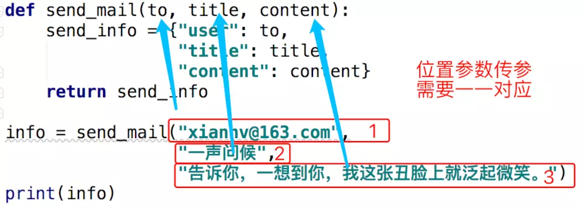
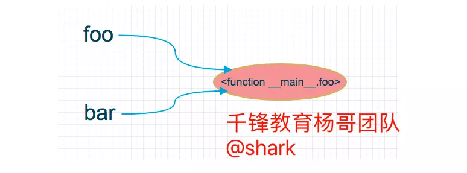

## 十二、函数式编程介绍

### 1、没有使用函数式编程之前带来的问题

1. 代码的组织结构不清晰，可读性差
2. 实现重复的功能时，你只能重复编写实现功能的代码，导致代码冗余，白白耗费精力
3. 假如某一部分功能需要扩展或更新时，需要找出所有实现此功能的地方，一一修改，无法统一管理，加大了维护难度

### 2、函数是什么

1. 函数是对实现某一功能的代码的封装(代码分解，松耦合，按功能划分)
2. 函数可以实现代码的复用，从而减少代码的重复编写

### 3、Python 中函数的特性

1. 函数的参数可以是python 中的任意数据类型，并且参数的数量可以是零个或多多个。
2. 函数也可以通过关键字 `return` 返回任何数量的 Python 中的任意数据类型，作为结果

### 4、函数分类

- **内置函数**
- <https://docs.python.org/zh-cn/3.7/library/functions.html>

​      为了方便我们的开发，针对一些简单的功能，python解释器已经为我们定义好了的函数即内置函数， 内部提供很多方法，常用功能罗列出来，类似为使用方便而创建的快捷方式

​      对于内置函数，我们可以拿来就用而无需事先定义，如len(),sum(),max() ​

```python
查看内置函数
s = dir(__builtins__)
print(s)

help()
dir()         #查看当前模块属性
vars()        #查看对象的属性和属性值
type()
reload(temp)  #重新加载模块
id()
is

#_*_ coding:utf-8 _*_
"""
代码注释
"""
l = [1, 2, 3]
a = 'aaa'
print(vars())   #当前模块的所有变量
print(__file__) #当前模块文件路劲
print(__doc__)  #当前模块的文档信息
print(__name__)   # python 默认在执行 .py 文件时，__name__ = __main__

import copy
print(copy.__name__) # 被执行的脚本 __name__ 的值 __main__

# 标识主程序是谁，（程序主文件标识）
if __name__ == "__main__":
    pass
____________________________    
abs()   --绝对值
bool()   --布尔值 True False
divmod() 除法结果和余数
max()
min()
sum()
pow() **
_____________________________
len()
all()  #接受一个序列，判断所有值如果是真的（非空），返回True  否则返回false
l = ['aaa','bbb']
all(l)

any()  #只要有一个是真，就是真
练习一下  all（） any（）
——————————————————————————
chr()  #ascii 转换 接收数字，返回字符
ord()  #接收字符，返回数字
hex()  #十六进制
oct()  #八进制
bin()  #二进制
——————————————————————————
print(range(1,10))  #生成一个列表
print(xrange(1,10)) #是一个生成器  
#上述为python2的说法，看下3里面是怎样的

for i in range(0, 100):
  print i
 
这两个输出的结果都是一样的，实际上有很多不同，range会直接生成一个list对象：

a = range(0,100)
print type(a)
print a
print a[0], a[1]
输出结果：
<class 'range'>
[0, 1, 2, 3, 4, 5, 6, 7, 8, 9, 10, 11, 12, 13, 14, 15, 16, 17, 18, 19, 20, 21, 22, 23, 24, 25, 26, 27, 28, 29, 30, 31, 32, 33, 34, 35, 36, 37, 38, 39, 40, 41, 42, 43, 44, 45, 46, 47, 48, 49, 50, 51, 52, 53, 54, 55, 56, 57, 58, 59, 60, 61, 62, 63, 64, 65, 66, 67, 68, 69, 70, 71, 72, 73, 74, 75, 76, 77, 78, 79, 80, 81, 82, 83, 84, 85, 86, 87, 88, 89, 90, 91, 92, 93, 94, 95, 96, 97, 98, 99]
0 1
　　
而xrange则不会直接生成一个list，而是每次调用返回其中的一个值：
a = xrange(0,100)
print type(a)
print a
print a[0], a[1]
结果如下：
<type 'xrange'>
xrange(100)
0 1

enumerate()
l = [1,2,3,4]
for v in enumeratel():
    print(v)
# 观察规律
    
l = [1,2,3,4]
for v in enumerate(l,100):
    print(v)
# 设定起始值
```

- **自定义函数**

​    很明显内置函数所能提供的功能是有限的，这就需要我们自己根据需求，事先定制好我们自己的函数来实现某 种功能，以后，在遇到应用场景时，调用自定义的函数即可。

- **导入函数**

    

### 5、函数的定义

#### 1 、如何自定义函数？

函数的定义中可能会涉及到如下几点：

语法

```python
def 函数名(参数1,参数2,参数3,...):
    '''注释'''
    函数体
    return 返回的值

# 函数名要能反映函数本身所实现的意义
```

- def：表示定义函数的关键字
- 函数名：函数的名称，日后根据函数名调用函数
- 函数体：函数中进行一系列的逻辑计算，如：发送邮件、计算出 [11,22,38,888,2]中的最大数等...
- 参数：为函数体提供数据
- return：当函数执行完毕后，可以给调用者返回数据(以后的代码不再执行)。

实例

```python
def f():
    pass

def myfunc():
    's' + 1
```

#### 2. 函数在定义阶段都干了哪些事？

只检测定义函数所要求的语法，不执行函数体内的代码

也就说，语法错误在函数定义阶段就会检测出来，而代码的逻辑错误只有在调用执行时才会知道。

```python
def get_result():
    r - 1

get_result()

# 调用函数后会输出如下错误提示结果：
NameError: name 'r' is not defined
    
get_reuslt = """
    r - 1
"""
```

### 6、函数调用

#### 1、函数调用

函数的调用：**函数名加小括号**
 `func()`

1. 先找到名字
2. 根据名字调用代码

```python
def myfunc():
    url = "www.qfedu.com"
# 调用    
myfunc()  
```

#### 2、函数使用的原则：必须先定义，才可以调用

> ##### 定义函数就是在定义“变量”，“变量”必须先定义后，才可以使用。
>
> ##### 不定义而直接调用函数，就相当于在使用一个不存在的变量名

```python
# 情景一
def foo():
    print('from foo')
    func()

foo()  # 报错

# 情景二
def func():
    print('from func')
def foo():
    print('from foo')
    func()

foo()  # 正常执行

# 情景三
def foo():
    print('from foo')
    func()
    
def func():
    print('from func')

foo()  # 可以正常执行吗？
```


```
需求，自定义函数实现监控告警(cpu,disk,mem)
def email发送邮件（）
    (连接，发送，关闭)
    
def CPU告警()
	cpu > 80
    email发送邮件

def disk告警()
    disk > 80
    email发送邮件

def mem告警()
	mem > 60
    email发送邮件
```


```python
# 发送邮件
import smtplib
from email.mime.text import MIMEText
from email.utils import formataddr

msg = MIMEText('邮件内容', 'plain', 'utf-8')
msg['From'] = formataddr(["newrain",'newrain_wang@163.com'])
msg['To'] = formataddr(["me",'l161733918@qq.com'])
msg['Subject'] = "主题"
 
server = smtplib.SMTP("smtp.163.com", 25)
server.login("newrain_wang@163.com", "邮箱密码")
server.sendmail('newrain_wang@163.com', ['1161733918@qq.com',], msg.as_string())
server.quit()
```


```
自定义函数
需求，实现监控告警
def cpu_email发送邮件（）
    (连接，发送，关闭)
    
def disk_email发送邮件（）
    (连接，发送，关闭)
    
def mem_email发送邮件（）
    (连接，发送，关闭)
    
def CPU告警()
	cpu > 80
    cpu_email发送邮件

def disk告警()
    disk > 80
    disk_email发送邮件

def mem告警()
	mem > 60
    mem_email发送邮件
```


```
引入函数参数
def email发送邮件(邮件内容)
    (连接，发送，关闭)

while True： 
    if cpu利用率 > 90:
        email发送邮件("CPU告警")
 
    if 硬盘使用空间 > 90%:
        email发送邮件("disk告警")
 
    if 内存占用 > 80%:
        email 邮件("mem告警")
```

#### 3、总结

- 函数的使用,必须遵循的原则是:先定义,后调用
- 在使用函数时,我们一定要明确地区分定义阶段和调用阶段
- 在函数体里面的任何代码都只是定义而已，只有在调用此函数时，这个函数内的代码才会执行。

```python
# 定义阶段
def foo():
    print('from foo')
    func()
def func():
    print('from func')
    
# 调用阶段
foo()
```

### 7、函数返回值 `return` 

- 不定义，默认返回 None
- 返回多个值时，每个值用逗号隔开，也就是元组的形式

#### 1、如何自定义返回值

使用 `return` 关键字

```python
def foo():
    x = 1
    return x

ret = foo()  # 给你, 这一步相当于下面的一行代码，就是 foo() 执行完毕，
                 #创建了 1 这个对象，之后把变量名  ret  分配给对象  1 
# ret = 1

print(ret)
```

#### 2、接收函数的返回值

**注意：必须先执行函数，此函数的返回值才会被创建并返回**

```python
# 可以使用一个变量来接收一个函数的返回值
ret = foo()

print("foo 函数的返回值是:", ret)

# 也可以把函数的返回值直接作为参数来使用,这时函数 `foo` 会先被执行，
# 之后把其返回值放在其原来的位置，以供 `print` 函数作为参数使用
print("foo 函数的返回值是:", foo())
```

> 在函数执行的过程中，当在函数体内遇到了 `return`关键字，函数就会立刻停止执行，并返回其返回值， `return` 之后的代码`不会`被执行。

```python
def func():
    x = 100
    return
    print('ok')   # 不执行

print('qf')       # 执行，因为此代码已不是函数体内的代码了，注意缩进。
func()
```

**定义一个有返回值的函数，并调用此函数**

```python
def echo(arg):
    return arg  # 用关键字 return 定义函数的返回

# 调用函数，并用一个变量接收其返回值
ret = echo('yangge')
print(ret)

# 执行 print 的结果
'yangge'
  

# 当一个函数没有显式的调用 return 时，默认会返回 None
def do_nothing():
     print('ok')

# 下面的方式，会先执行函数体内的代码，之后把函数自身的返回值
# 放在其函数原来的位置，并且作为参数给 print
print(do_nothing())
ok                            # 函数体本身执行的结果
None                          # 函数自身的返回值
 
# 函数可以返回一个以及多个Python 的任何数据类型的结果    
```

```
函数数返回值练习：

def email发送邮件(问题)
    (连接，发送，关闭)
        if 1==1:  #发送成功
        	print('True')
        else:    # 发送失败
            print('False')

while True： 
    if cpu利用率 > 90:
    	问题=‘cpu问题内容’
        返回结果=email发送邮件(问题)
        if 返回结果==false
        	#记录日志或者再次发送一次邮件
			email发送邮件(问题) 
    if 硬盘使用空间 > 90%:
    	问题=‘disk问题内容’
        返回结果=email发送邮件(问题)
        if 返回结果==false
        	#记录日志或者再次发送一次邮件
			email发送邮件(问题)
    if 内存占用 > 80%:
    	问题=‘mem问题内容’
        返回结果=email发送邮件(问题)
        if 返回结果==false
        	#记录日志或者再次发送一次邮件
			email发送邮件(问题)
```

### 8、函数的参数

**以下是重点，需要加强练习，理解原理，掌握用法和技巧**

- 函数的参数是为函数体内的逻辑代码提供数据的。
- 函数的参数形式有 **形参和实参**
- 分类有：

  - 普通参数

  - 默认参数

  - 动态参数

#### 1.  什么是形参

对于函数来说，形式参数简称形参，是指在定义函数时，定义的一个变量名；

下面的代码中，x、y、z 就是形参

```python
def foo(x, y, z):
    print("第一个参数是", x)
    print("第二个参数是", y)
    print("第三个参数是", z）
```

#### 2. 什么是实参

 对于函数来说，实际参数简称实参。
 是指在调用函数时传入的实际的数据，这会被绑定到函数的形参上；
 函数调用时，将值绑定到变量名上，函数调用结束，解除绑定，并且实参将不再存在于程序中。

```python
foo(1,2,3)
```

> 上面的 1、  2  和 3 都是实参

#### 3. 形参分为：位置参数和默认参数

##### a. 位置参数

```python
def send_mail(to, title, content):
    send_info = {"user": to,
                 "title": title,
                 "content": content}
    return send_info
```

> 形参的位置参数，在调用函数时必须给其传递实参。
>  但是，在函数内使用与否 ，没有限制。

##### b. 默认参数

```python
def default_mail(title,  content,  to='xiannv@163.com'):
    send_info = {"user": to,
                 "title": title,
                 "content": content}
    return send_info
```

> 默认参数在函数定义的时候，就已经绑定了实际的值了。
>  调用函数时，可以给其传值，也可以不传。
>
> - 不传值   就使用定义函数时绑定的值。
> - 传值      就是使用传递的值。
>
> 同样，在函数内使用与否 ，没有限制。

#### 4. 实参分为：位置参数和关键字参数

说的实参实质就是在调用函数时，给位置参数的进行赋值，这个行为通常叫做给函数 `传参`

因此，大家要明白，这里的 `位置参数` 和 `关键字参数` 是在函数调用的情况下的概念。

##### a. 位置参数传递参数

**给形参的位置参数传参**

```python
info = send_mail("xiannv@163.com", 
                 "一生问候", 
                 "告诉你，一想到你，我这张丑脸上就泛起微笑。")
print(info)
```

还可以这样传参

```python
def myfunc(x, y, z):
    print(x, y, z)

tuple_vec = (1, 0, 1)
dict_vec = {'x': 1, 'y': 0, 'z': 1}

>>> myfunc(*tuple_vec)
1, 0, 1

>>> myfunc(**dict_vec)
1, 0, 1
```

**给默认参数传参**

```python
info = default_mail( "一生问候", 
                     """因为你太美好了，
                        我等你等了这么久，
                        才能跟你在一起，
                        我害怕得不得了，
                        生怕自己搞砸了""",
                     "xiannv@163.com", )

print(info)
```

> 当使用实参的位置参数传参时，需要考虑到定义函数时的形参的位置。


 

##### b. 关键字参数传递参数

```python
info = send_mail(content="我爱你，不光是因为你的样子，还因为和你在一起时，我的样子", 
                 title="一生问候",
                 to="jingjing@126.com")

print(info)
```

> 使用关键字参数传参时，不必考虑形参的位置。但是需要注意，关键字必须和在定义函数时形参一致。

**实参角度的参数结论：**

1. 在调用函数时，给形参的位置参数或形参的默认参数进行赋值时，可以用实参的位置参数进行传参； 此时传递的实参的顺序，必须和形参的位置顺序一一对应
2. 在调用函数时，给形参的位置参数或形参的默认参数进行赋值时， 也可以使用实参的关键字参数进行传参； 此时，关键字参数之间是不区分位置顺序的
3. 在调用函数时，形参的默认参数不传参数给它，此时，默认参数的值就是原来定义的值；假如传了参数，就使用传入的参数的值。

#### 5. 万能参数： `*args` 和 `**kwargs` （动态参数）

##### a.  用 `*` 表达式接收传进来的任意多个未明确定义的位置参数

```python
def foo(x, y, *args):
    print(args)

foo(1, 3, 5, 6)
list1 = [1,2,3,4,5]

foo(*list1)
foo(list1)


def foo(x, y, *args):
    print(args)
    print(x)
    print(y)
# foo(1, 3, 5, 6)
# foo(1,2,3,4,5,6)
# print(foo(1,2,3,4,5))

list1=['a','b','c','d']
t1=('a','b','c','d')
s1='helloworld'
#foo(list1,t1)
foo(1,2,list1,t1)  # 不是序列的可以不用加*
foo(1,2,*list1)   #只有在传入序列的时候加*

# 输出如下
(['a', 'b', 'c', 'd'], ('a', 'b', 'c', 'd'))
1
2
('a', 'b', 'c', 'd')+
1
2
```

> 在函数体内接收到的参数会放在元组中

##### b. 用 `**` 表达式接收传进来的任意多个未明确定义的关键字参数

```python
def func(x, y, **kwargs):
    print(kwargs)

func(1, 3, name='shark', age=18)

func(1,2,3,4,5)  #是否会报错

dict1={'k1':'a','k2':'b'}
func(1,2,**dict1)

def func(x,y,*args,**kwargs):
    print(kwargs)
    print(args)
    print(x)
    print(y)

#func(1,2,3,4)
func(1,3,name='aaa',age=18)
d2 = {'k1':'aaa','k2':'18'}
l1 = [1,2,3,4]
print(type(d2))
func(1,2,*l1,**d2)  # 加*号调用，就会以序列的元素为元素组成一个元祖
func(1,2,l1)        # 直接调用序列，会把整个序列作为元祖的一个元素

# 输出如下
{'age': 18, 'name': 'aaa'}
()
1
3
<type 'dict'>
{'k2': '18', 'k1': 'aaa'}
(1, 2, 3, 4)
1
2
{}
([1, 2, 3, 4],)
1
2
```

> 在函数体内接收到的参数会放在字典中

```python
相结合的方式
def func1(*args,**kwargs):
    print(args)
    print(kwargs)

func1(1,2,3)
func1(k1=1,k2=2)
func1(1,2,3,k1='a',k2='b')
```


#### 6、重要的东西，需要总结一下吧

函数参数从形参角度来说，就是在定义函数时定义的变量名，分为三种：

1.  `位置参数` 如： arg1,arg2

所用的参数是有位置的特性的，位置是固定的，传参时的值也是要一一对应的

1.  `默认参数` 如：arg = 5
2.  `动态参数` 如： *args,**kwargs, 可以同时用

==三种形参在定义函数时的顺序如下：==

```python
In [108]: def position_arg(arg1, arg2, *args, **kwargs):
     ...:     pass
     ...:
```

函数参数从实参角度来说，就是在调用函数时给函数传入的实际的值，分为两种

1. `位置参数`

在传参时，值和定义好的形参有一一对应的关系

1. `关键字参数`

在传参时，利用key = value 的方式传参，没有对位置的要求

### 9、匿名函数

**lambda 是用一条语句来表式的匿名函数，可以用它来代替简单的小函数。**

```python
# 与函数有相同的作用域，但是匿名意味着引用计数为0，使用一次就释放，除非让其有名字
# 先看一个简单的普通函数 
In [125]: def f1(arg1,arg2):
     ...:     return arg1 + arg2
     ...:
         
# 再看 lambda 表达式

# 语法格式：
# lambda 参数：函数体

# 示例：
In [126]: lambda arg: arg+1    
sum1= lambda arg: arg+1
sum1(5)

In [127]: lambda arg1,arg2: arg1 + arg2
Out[127]: <function __main__.<lambda>>

sum2 = lambda arg1,arg2:arg1 + arg2
sum2(5, 6)


def f1(arg1,arg2):
    return arg1+arg2
print(f1(4,5))

sum1=lambda arg1,arg2: arg1+arg2
print(sum1(4,5))

l1=[1,2,3,4]
d1={'k1':'a','k2':'v'}
s1=lambda x,y,*args,**kwargs: print(x,y,args,kwargs)
s1(1,2,*l1,**d1)

# 处理简单逻辑
# 自动return
# 支持动态参数

```

### 10、作业

#### 1、源数据

```python
5497 click_sum:3 percent:100.0%
4826 click_sum:1 percent:0.0%
6522 click_sum:201 percent:51.24%
6367 click_sum:712 percent:1.83%
6368 click_sum:1462 percent:4.79%
5346 click_sum:733 percent:6.68%
3812 click_sum:29 percent:0.0%
4841 click_sum:851 percent:0.0%
5873 click_sum:217 percent:28.57%
6316 click_sum:4 percent:0.0%
6900 click_sum:28 percent:7.14%
7416 click_sum:6 percent:0.0%
6989 click_sum:50 percent:0.0%
6990 click_sum:21 percent:0.0%
4944 click_sum:15 percent:100.0%
6485 click_sum:88 percent:0.0%
7039 click_sum:28 percent:92.86%
2432 click_sum:153 percent:5.88%
6018 click_sum:4 percent:0.0%
6024 click_sum:28 percent:100.0%
1930 click_sum:175 percent:6.29%
2444 click_sum:3725 percent:7.54%
2451 click_sum:3505 percent:0.23%
7060 click_sum:111 percent:51.35%
3989 click_sum:715 percent:41.54%
6039 click_sum:42 percent:0.0%
2457 click_sum:13 percent:46.15%
5530 click_sum:64 percent:0.0%
7582 click_sum:124 percent:0.81%
7071 click_sum:8 percent:0.0%
5537 click_sum:5 percent:100.0%
4763 click_sum:1 percent:100.0%
5540 click_sum:186 percent:0.54%
5033 click_sum:2337 percent:73.47%
4522 click_sum:1668 percent:0.54%
4523 click_sum:62 percent:1.61%
7084 click_sum:432 percent:1.85%
6063 click_sum:247 percent:0.0%
5553 click_sum:68 percent:0.0%
6583 click_sum:13 percent:100.0%
6127 click_sum:22 percent:0.0%
6057 click_sum:6 percent:0.0%
6138 click_sum:15 percent:6.67%
4607 click_sum:10 percent:0.0%
6652 click_sum:8 percent:0.0%
4010 click_sum:1 percent:100.0%
3583 click_sum:2239 percent:36.8%
4446"in_offer_id":107466987-"in_affiliate_id":4631-"result_code":1604
1649"in_offer_id":98399105-"in_affiliate_id":5988-"result_code":1607
800"in_offer_id":106901072-"in_affiliate_id":4666-"result_code":1604
594"in_offer_id":106351217-"in_affiliate_id":7373-"result_code":1604
531"in_offer_id":107466987-"in_affiliate_id":3882-"result_code":1606
393"in_offer_id":108314256-"in_affiliate_id":5411-"result_code":1601
356"in_offer_id":108230131-"in_affiliate_id":5033-"result_code":1601
291"in_offer_id":108230207-"in_affiliate_id":5033-"result_code":1604
284"in_offer_id":108923434-"in_affiliate_id":3583-"result_code":1604
210"in_offer_id":108231457-"in_affiliate_id":5033-"result_code":1800
```

#### 2、目标数据模板

```python
7545 click_sum:149 percent:97.32%
4773 click_sum:277 percent:86.28%
5411 click_sum:466 percent:84.55%
2902 click_sum:147 percent:80.95%
5988 click_sum:2041 percent:80.84%
5033 click_sum:2337 percent:73.47%
5580 click_sum:250 percent:55.2%
7115 click_sum:346 percent:54.34%
4666 click_sum:1526 percent:54.26%
```

#### 3、要求说明

> 找到 click_sum 的值大于 100 且 percent 的值大于 30% 的数据，并且
>  按照 percent 的值 进行由大到小进行排序打印出来

#### 4、代码

```python
# click_num的值大于100且percent的值大于30，然后从大到到小排序
import traceback

# 读取文件内容
with open('source.txt', 'r') as f:
    # 得到源数据并且成为列表
    content_list = f.read().split('\n')

lines = []

# 循环源数据列表
for line in content_list:
    # 判断是我们要的数据
    if 'click_sum' in line:

        # 拿到我们需要比较的两个数据部分
        # click_sum:149 和 percent:97.32%
        _, click_sum, percent = line.split()

        # 分割得到具体数据
        sum = click_sum.split(':')[-1]
        per = percent.replace('%', '').split(':')[-1]
        try:
            # 类型转换
            sum = int(sum)
            per = float(per)

            # 判断 click_num的值大于100且percent的值大于30 的数据行
            if sum > 100 and per > 30:

                # 把符合条件的数据和需要比对的数据放在一个列表中添加到中列表中
                # # [[54.26, '4666 click_sum:1526 percent:54.26%']]
                lines.append([per, line])
        except Exception as e:
            # 假如有异常就打印出如下信息
            print("获取到的数据不是数字类型的，无法装换比较")
            print(traceback.format_exc())


# print(lines)

# 最终的数据
# [[54.26, '4666 click_sum:1526 percent:54.26%'], [37.57, '6212 click_sum:173 percent:37.57%'], [52.04, '6214 click_sum:294 percent:52.04%'], [40.33, '3671 click_sum:362 percent:40.33%'], [86.28, '4773 click_sum:277 percent:86.28%'], [53.87, '7373 click_sum:1214 percent:53.87%'], [51.24, '6522 click_sum:201 percent:51.24%'], [84.55, '5411 click_sum:466 percent:84.55%'], [40.74, '3882 click_sum:1318 percent:40.74%'], [80.95, '2902 click_sum:147 percent:80.95%'], [80.84, '5988 click_sum:2041 percent:80.84%'], [97.32, '7545 click_sum:149 percent:97.32%'], [51.35, '7060 click_sum:111 percent:51.35%'], [41.54, '3989 click_sum:715 percent:41.54%'], [73.47, '5033 click_sum:2337 percent:73.47%'], [34.17, '7113 click_sum:120 percent:34.17%'], [54.34, '7115 click_sum:346 percent:54.34%'], [55.2, '5580 click_sum:250 percent:55.2%'], [36.8, '3583 click_sum:2239 percent:36.8%']]

# 排序
"""
lambda item: item[0]  是一个匿名函数
利用 [54.26, '4666 click_sum:1526 percent:54.26%'] 的第一元素进行比较

# 给 sort 函数传入参数 reverse=True， 进行有大到下排序 
"""
lines.sort(key=lambda item: item[0], reverse=True)
# print(lines)
# [[97.32, '7545 click_sum:149 percent:97.32%'], [86.28, '4773 click_sum:277 percent:86.28%'], [84.55, '5411 click_sum:466 percent:84.55%'], [80.95, '2902 click_sum:147 percent:80.95%'], [80.84, '5988 click_sum:2041 percent:80.84%'], [73.47, '5033 click_sum:2337 percent:73.47%'], [55.2, '5580 click_sum:250 percent:55.2%'], [54.34, '7115 click_sum:346 percent:54.34%'], [54.26, '4666 click_sum:1526 percent:54.26%'], [53.87, '7373 click_sum:1214 percent:53.87%'], [52.04, '6214 click_sum:294 percent:52.04%'], [51.35, '7060 click_sum:111 percent:51.35%'], [51.24, '6522 click_sum:201 percent:51.24%'], [41.54, '3989 click_sum:715 percent:41.54%'], [40.74, '3882 click_sum:1318 percent:40.74%'], [40.33, '3671 click_sum:362 percent:40.33%'], [37.57, '6212 click_sum:173 percent:37.57%'], [36.8, '3583 click_sum:2239 percent:36.8%'], [34.17, '7113 click_sum:120 percent:34.17%']]

for line in lines:
    print(line[-1])
```

## 十三、名称空间和作用域

可以简单理解为存放变量名和变量值之间绑定关系的地方。

### 1、名称空间

在 Python 中有各种各样的名称空间：

- 全局名称空间：每个程序的主要部分定义了全局的变量名和变量值的对应关系，这样就叫做**全局名称空间**
- 局部名称空间：在函数的运行中定义的临时的空间叫做**局部名称空间**，只可以被这个函数所有。函数运行结束后，这个局部的名称空间就会销毁。
- 内置名称空间：内置名称空间中存放了python解释器为我们提供的名字：input,print,str,list,tuple...它们都是我们熟悉的，拿过来就可以用的方法。

#### 1、三种名称空间之间的加载顺序

```python
python3 test.py

# 1、python解释器先启动，因而首先加载的是：内置名称空间
# 2、执行test.py文件，然后以文件为基础，加载全局名称空间
# 3、在执行文件的过程中如果调用函数，则临时产生局部名称空间
```

#### 2、名字的查找顺序

当我们要使用一个变量时，先从哪里找？

**局部使用：局部名称空间——>全局名称空间——>内置名称空间**

```python
x = 1
def f1():
    x = 10
    print(x)

f1()  # 输出 10
```

**全局使用：全局——>内置**

```python
#需要注意的是：在全局无法查看局部的，在局部可以查看全局的，如下示例

x = 1
def f1():
    x = 10
    print(x)

print(x)  # 输出  1
```

### 2、作用域

作用域就是变量名的生效范围

分为： **全局作用域 和 局部作用域**

#### 1、全局作用域

内置的名称空间中的名字和全局名称空间的名字属于这个全局作用域。

- 全局作用域中的名字，在整个文件的任意位置都能被引用，全局存活，全局内都有效。

#### 2、局部作用域

局部名称空间的名字属于局部作用域。

- 局部作用域中的名字只能在其本地局部生效和使用。
- `python` 中局部作用域就是函数内定义或生成的名字，临时存活，随着函数调用的结束而消失。

## 十四、高阶函数介绍

### 1、特点

- 把一个函数的函数名当做实参传给另一个函数
- 函数本身可以作为另外一个函数的返回值

```python
def foo():
       return 10

def func(bar):
        print(id(bar), bar)
        
func(foo())
#def func(foo):
#    	print(id(foo),foo)

# 直接打印原函数的 id
print(id(foo))

# 调用函数 并把 foo 作为实参传递进去，查看传输的函数的 id
func(foo())
```

在调用函数 `func(foo)` 时，如下图：

 

> 可以看出被传入的函数和原函数是一个对象

### 2、内部函数

在一个函数内部定义的函数

```python
def outer():
    def inner():
        x = 10
```

> 函数 `inner` 就是一个内部函数

### 3、 闭包

**是一个函数动态生成的另一个函数，并且返回一个 包含了外部作用域而非全局作用域变量名称的函数。这个函数可以使用外部作用域的变量。**

**闭包是由函数及其相关的引用环境组合而成的实体(即：闭包=函数+引用环境)**

python语言中形成闭包的三个条件，缺一不可：
1)必须有一个内嵌函数(函数里定义的函数）——这对应函数之间的嵌套
2)内嵌函数必须引用一个定义在闭合范围内(外部函数里)的变量——内部函数引用外部变量
3)外部函数必须返回内嵌函数——必须返回那个内部函数

```python
# 什么是闭包
# 定义一个函数
def test(number):
 
    # 在函数内部再定义一个函数，并且这个函数用到了外边函数的变量，那么将这个函数以及用到的一些变量称之为闭包
    def test_in(number_in):
        print("in test_in 函数, number_in is %d" % number_in)
        return number+number_in
    # 其实这里返回的就是闭包的结果
    return test_in
 
 
# 给test函数赋值，这个20就是给参数number
ret = test(20)
 
# 注意这里的100其实给参数number_in
print(ret(100))
 
# 注意这里的200其实给参数number_in
print(ret(200))

# 运行结果：
in test_in 函数, number_in is 100
120
in test_in 函数, number_in is 200
220

#_*_ coding:utf-8 _*_
# def test():
#     x = 10
#     def test_in(num_in):
#         print("在test_in函数, num_in is %d" % num_in)
#         return x + num_in
#     print(x)
#     return  test_in
#test()
# 1. 调用test函数，开始执行函数
# 2，产生局部变量 x = 10
# 3，定义一个函数（没有调用，不执行），只有test_in函数方法
# 4, 打印输出变量x
# 5，把定义的test_in 这个函数返回给调用者（test函数调用的）
# 6，最后获取的的值 test_in 函数
# ret = test()
# 把返回的test_in函数重命名为ret（类似于变量赋值）
# print(ret)
# 打印输出一下test_in函数方法，返回test_in 函数方法
# print(ret(1000))
# 相当于调用了 test_in函数，返回 test_in 返回值（相加的结果）

def test(arg):
    def test_in(num_in):
        print("在test_in函数, num_in is %d" % num_in)
        return arg + num_in
    print(arg)
    return  test_in
test(10)  # 打印了一下arg ===》10
print(test(10))  # 打印10 并放回test_in 函数
ret1 = test(10)  # 把test函数的返回值赋值给ret1
print(id(ret1))  # 打印ret1的函数内存位置（也就是test_in这个函数的内存位置）
print(ret1(100)) # 调用了test_in函数，返回了结果 arg ===>10  + num_in ===》100  ===》110
```


```python
#函数可以作为另一个函数的参数或返回值，可以赋给一个变量。函数可以嵌套定义，即在一个函数内部可以定义另一个函数，有了嵌套函数这种结构，便会产生闭包问题。如：

def outer(f):
    def inner():
        print(f)
    return inner

really_inner = outer(10)

really_inner()
```

上面的 `f` 可以是任何的 `python` 对象，当然也可以是给函数。

```python
def foo():
    pass

def outer(f)
    def inner():
        print(f)
    return inner

really_inner = outer(foo)
```

此时， really_inner 就是闭包, 其本质就是 `inner` 函数对象, 并且包含了 `foo` 这个函数对象。

创造一个闭包：

```python
def line_conf():
    def line(x):
        return 2*x+1
    return line       # 返回line 函数对象

my_line = line_conf()
print(my_line(5))

def line_conf():
    b = 15
    def line(x):
        return 2*x+b
    return line       # 返回line 函数对象
 
b = 5
my_line = line_conf()
print(my_line(5))    # 返回25

# 在内部函数中只能对外部函数的局部变量进行访问，但是不能修改，如果需要修改则需要用到nonlocal关键字，委屈求全可以使用“容器类型”代替

def line_conf():
    b = 15
    def line(x):
        nonlocal b
        b=20
        return 2*x+b
    return line       # return a function object
 
b = 5
my_line = line_conf()
print(my_line(5))     #返回30

def line_conf():
    b = [15]
    def line(x):
        b[0]=20
        return 2*x+b[0]
    return line       # return a function object

my_line = line_conf()
print(my_line(5)) #返回30
```

我们根据上面的三准则创造了一个函数，其中的funy就是所谓的闭包，而funy内部所引用过的x就是所谓的闭包变量。

**闭包有什么用**

在交互式模式下，对函数进行简单的测试：

```python
def funx():
    x=5
    def funy():  # 内部函数中只能对外部函数的局部变量进行访问，不能修改
        nonlocal x  # 如果需要修改则需要用到 nonlocal关键字
        x+=1
        return x
    return funy
    
>>> a=funx()
>>> a()
6
>>> a()
7
>>> a()
8
>>> a()
9
>>> x
Traceback (most recent call last):
  File "<pyshell#19>", line 1, in <module>
    x
NameError: name 'x' is not defined
>>> 
```

funx中的x变量原本仅仅是funx的一个局部变量。但是形成了闭包之后，它的行为就好像是一个全局变量一样。但是最后的错误说明x并不是一个全局变量。其实这就是闭包的一个十分浅显的作用，形成闭包之后，闭包变量能够随着闭包函数的调用而实时更新，就好像是一个全局变量那样。（注意我们上面的a=funx()，a实际上应该是funy，所以a称为闭包）

### 4、 装饰器

#### 1、原始方式实现(老的方式)

```python
def echo():
    print('欢迎来到千锋云计算')

def outer(arg):   # arg = echo ---> arg()===echo()
    def inner():
        print("*" * 20)
        arg()     # echo() 原函数
        print("*" * 20)
    return inner

echo = outer(echo)   # 最终的结果是inner()函数

# def outer(echo): 
#     def inner():
#         print("*" * 20)
#         echo()
#         print("*" * 20)
#     return inner

echo()

# 执行流程
# 1，运行echo()函数 （放进内存）
# 2，运行outer(arg)函数 （放进内存）
# 3，重新赋值后调用 outer(arg)函数，
# 4，运行inner()函数 （放进内存）
# 5，调用inner()函数并返回结果
# 6，echo()得到新结果
# 7，业务线的调用echo()函数的方式没有变，但功能添加了
# 8，业务线调用新的echo()函数，就开始执行inner函数
# 9，根据函数执行顺序，包含了原来的echo()函数和添加的功能
```

#### 2、语法糖实现(目前使用此种方式)

```python
def outer(arg):   # arg = echo()
    def inner():
        print("*" * 20)
        arg()     # echo 原函数
        print("*" * 20)
    return inner

@outer   
# 1, 执行outer函数 outer(echo),
# 2，获取outer的返回值，并把返回值赋值给被装饰的函数的函数名，echo = outer(echo) 最终 echo=inner()
def echo():
    print('欢迎来到千锋云计算')

echo()

# 执行装饰器，对被装饰的的函数进行重新赋值
```

**使用装饰器的理由**

在软件开发领域有个规则：

在开发时，需要遵循 开放封闭原则，就是对扩展开放，对修改封闭。

扩展开放，就是可以对原来的函数功能进行扩展。

修改封闭，就是给原来的函数添加功能的时候，不可以直接修改原来的函数。

**装饰器的作用是什么**

装饰器时装饰其他对象的器具，本身可以是任意可调用对象，被装饰者也可以是任意可调用对象。

**强调装饰器的原则：**

1. 不修改被装饰对象的源代码
2. 不修改被装饰对象的调用方式

**装饰器的目标：**

在遵循1和2的前提下，为被装饰对象添加上新功能

#### 3、补充内置函数 枚举 `enumerate`

```python
li = ["hello","world", 'len', 'network']
#
# for idx, item in enumerate(li):
#     print(idx, item)


# for idx, item in enumerate(li, 1):
#     print(idx, item)
```
