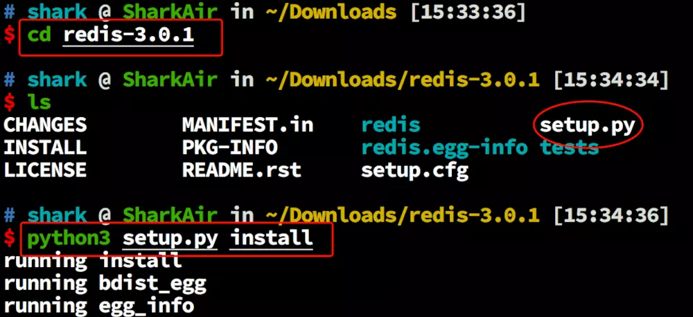
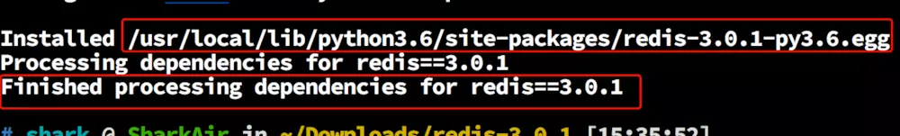
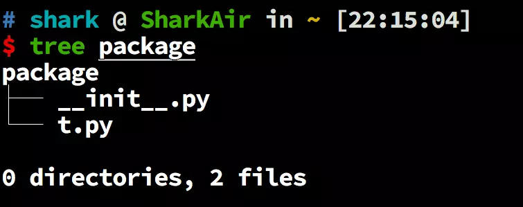
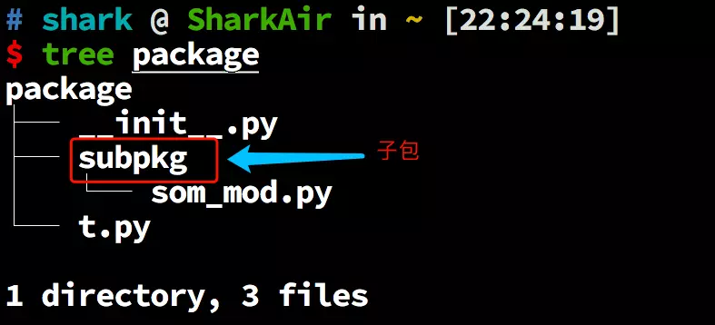
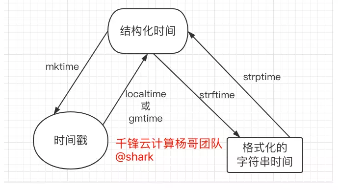

## 十六、模块的导入和使用

### 1、模块介绍

- Python 有时候称为胶水语言，就是因为它有强大的可扩展性，这个扩展性就是用模块实现的。

- 模块其实就是一个以 `.py` 结尾的 Python 文件，这个文件中可以包含变量、函数、类等。

- 模块可以包含实现了一个或者多个功能的代码。

- 模块可以在其他 Python 文件中使用，可以通过网络进行传播。

这样的话，如果想在你的程序中实现某些功能，其实网络的其他程序猿已经给你写好了，下载下来，安装到自己的环境下，就可以使用了。

### 2、为什么要模块化

**模块化编程**是指将大型，笨拙的编程任务分解为单独的，更小的，更易于管理的子任务或**模块的过程**。然后可以像构建块一样拼凑单个模块以创建更大的应用程序。

在大型应用程序中**模块化**代码有几个优点：

- **简单性：**模块通常只关注问题的一小部分，而不是关注当前的整个问题。如果您正在处理单个模块，那么您的头脑中要思考的将有一个较小的问题范围。这使得开发更容易，更不容易出错。
- **可维护性：**模块通常设计为能够在不同的问题域之间实施逻辑边界。如果以最小化相互依赖性的方式编写模块，则对单个模块的修改将对程序的其他部分产生影响的可能性降低。（您甚至可以在不了解该模块之外的应用程序的情况下对模块进行更改。）这使得许多程序员团队在大型应用程序上协同工作更加可行。
- **可重用性：**单个模块中定义的功能可以通过应用程序的其他部分轻松地重用。这消除了重新创建重复代码的需要。
- **范围：**模块通常定义一个单独的**命名空间**，这有助于避免程序的不同区域中的变量名之间的冲突。

**函数**，**模块**和**包**都是Python中用于促进代码模块化的构造。

### 3、模块的分类

#### 1、实现方式分类

实际上有两种不同的方法可以在Python中定义**模块**：

1. 模块可以用Python本身编写。
2. 模块可以用**C**编写并在运行时动态加载，就像`re`（**正则表达式**）模块一样。

以上两种情况下，模块的内容都以相同的方式访问：使用`import`语句

#### 2、模块的归属分类

- 1. 包含在解释中的一个**内置的**模块本，像[`itertools`模块](https://realpython.com/python-itertools/)。
- 1. 其他机构或个人开发者编写的模块，成为第三方模块
- 1. 自己写的 `.py` 文件，就是自定义的模块

#### 3、第三方模块

从网络上下载的模块称为 **第三方模块**。

#### 安装方法

##### 1、 `pip3` 工具安装

 例如下面的示例是安装用于执行远程主机命令的模块 `paramiko` 

```shell
注意： pip3 是 bash 环境下的命令
pip3 install paramiko
```

>  python2.x 使用 `pip`
>  python3.x 使用 `pip3`
>  当然这也不是固定的，比如你给 `pip3` 定义了一个别名 `pip`

##### 2、源码安装

源码安装就是，从网络上下载没有封装的 python 文件的源码，之后在本地执行其源码中的 `setup.py` 文件进行安装。

模块的源码一般都有一个主目录，主目录中包含了一个到多个子目录和文件。
 但是主目录下一定有一个 `setup.py` 的文件，这个是源码安装的入口文件，就是需要执行这个文件并且传入一个  `install` 参数进行源码安装。

示例：

###### a. 下载源码包

```shell
wget https://files.pythonhosted.org/packages/4a/1b/9b40393630954b54a4182ca65a9cf80b41803108fcae435ffd6af57af5ae/redis-3.0.1.tar.gz
```

###### b. 解压源码包

```shell
tar -xf redis-3.0.1.tar.gz
```

1. 进入模块源码的主目录，并安装源码包

 

 

> 上面表示安装成功

#### 4、自定义模块

有的情况下，是需要自己编写一些模块的，这种就是自定义模块了。

示例:

```python
some_mod.py
x = 10

li = ['shark', 18]

def foo():
    return 30

class Person():
    def __init__(self, name, age):
        self.name = name
        self.age = age
```

#### 5、内置模块

模块除了 **第三方模块**, **自定义模块**，还有 **内置模块**。

### 4、模块的使用

- 使用模块需要先导入模块名。

- 模块名就是把 `.py` 去掉后的文件名。比如 `some_mod.py` 的模块名就是 `some_mod`

#### 1、导入模块

```python
import  some_mod
```

#### 2、使用模块中的对象

要想使用模块中的变量名或者函数名等，只需要使用 `模块名.变量名` 的方式即可。

例如，下面是使用的了 `some_mod` 模块中的 `foo` 函数。

```python
import  some_mod

some_mod.foo()
```

#### 3、更多模块导入的方式

a.  从模块中导入其中的一个对象

```python
from some_mod  import  x
```

b. 从模块中导入多个对象

```python
from some_mod import x, foo
```

c. 从模块中导入全部的对象, 不建议这么做

```python
from some_mod import *
```

#### 4、导入模块时模块的代码会自动被执行一次

```python
st = """www.qfecu.com
千峰欢迎您!
www.qfecu.com
千峰欢迎您!
"""

print(st)
```

## 十七、包的导入和使用

### 1、包是什么？

- 包就是包含了一个 `__init__.py` 文件的文件夹，这个文件夹下可以有更多的目录或文件。就是说，包里可以用子包或单个 `.py` 的文件。

- 其实包也是模块，就是说包和单一的 `.py` 文件统称为模块。

### 2、包的目录结构

 

### 1、文件 `__init__.py` 

`__init__.py` 文件，在 Python3.x 中可以没有，但是在 Python2.x 中必须有。

文件中可以有代码，也可以是个空文件，但是文件名不能是其他的。

到导入包的时候，此文件假如存在，会以此文件去建包的名称空间。

也就是说，导入包的时候，只要在 `__init__.py` 文件中的名称才可以生效。否则，即使是一个模块在包目录下面也不会被导入到内存中，也就不会生效。

### 3、使用包

示例包目录机构

 

使用包也需要导入

#### 1、单独导入包

```python
import package  # 注意这样不会导入其下面的模块和子包
```

#### 2、 从包中导入下面的模块

```python
from package import t
```

#### 3、从包中导入下面的子包，注意这不会导入子包下面的任何模块

```python
from package import subpkg
```

#### 4、从包的子包中导入子包的模块

```python
from package.subpkg import som_mod
```

#### 5、从包或子包的模块中导入具体的对象

```python
from package.t  import foo

from package.subpkg.som_mod import x

from package.t  import x  as y   # 把 x 导入后起个别名 y
```

**记住一点：不论是导入包还是模块，从左向右的顺序来说，最后一个点儿的左边一定是一个包名，而不能是一个模块名**

下面是错误的

```python
import package.t.foo
from package.subpkg import som_mod.x
```

### 4、模块的内置变量 `__name__` 

每个 `.py` 文件都有一个变量名 `__name__`， 这个变量名的值会根据这个文件的用途不同而随之变化。

1. 当文件作为模块被其他文件使用时，`__name__` 的值是这个文件的模块名
2. 当文件作为脚本（就是作为可执行文件）使用时，`__name__` 的值是字符串类型的 `'__main__'`

通常你会看到一些 Python 脚本中会有类似下面的代码：

```python
some_script.py
def foo():
    pass

def func():
    pass

def main():
    foo()
    func()

if __name__ == '__main__':
    main()
    print('程序自身在运行')
else:
    print('我来自另一模块')
```

使用这个脚本

```python
python3 some_script.py
```

> 这样执行这个脚本的话，其内置的 `__name__` 变量的值就是字符串的 `'__main__'`。
>  这样的话， `if` 的判断添加就会达成，从而其语句下面的代码就会执行， `main()` 函数就会被调用 。

### 5、模块名的搜索路径

当你导入模块或者包的时候, 查找模块或包的顺序：

1. 系统会先从当前目录下查找
2. 之后再从`sys.path` 输出的值中的路径里查找模块名或者包名。

```python
import sys

print(sys.path)
```

`sys.path` 输出的值是一个 Python 的列表，这个列表我们可以对其修改的。

比如我们可以把某个文件的路径添加到此列表中，通常会这么做。

```python
run.py
import os
import sys

BASE_DIR = os.path.dirname(os.path.abspath(__file__))
sys.path.insert(0, BASE_DIR)

sys.path.insert(0,'D:\gitlab')  # 将D:\gitlab 添加到python解释器的查询列表中
print(sys.path)
```


## 十八、常用模块

### 1、sys 模块

提供了一系列有关Python运行环境的变量和函数

```python
#python3 sys模块
#sys模块负责程序与python解释器的交互，提供了一系列的函数和变量，
#用于操控python运行时的环境。

# sys.argv 接收命令行参数，生成一个List，第一个元素是程序本身路径
# sys.modules.keys() 返回所有已经导入的模块列表
# sys.exc_info() 获取当前正在处理的异常类,exc_type、exc_value、exc_traceback当前处理的异常详细信息
# sys.exit(n) 退出程序，正常退出时exit(0)
# sys.hexversion 获取Python解释程序的版本值，16进制格式如：0x020403F0
# sys.version 获取Python解释程序的版本信息
# sys.maxsize 获取内存中最大的Int值 python2中是maxint
# sys.maxunicode 获取内存从中最大的Unicode值
# sys.modules 返回系统导入的模块字段，key是模块名，value是模块
# sys.path 返回模块的搜索路径，初始化时使用PYTHONPATH环境变量的值
# sys.platform 返回操作系统平台名称
# sys.stdout 标准输出
# sys.stdin 标准输入
# sys.stderr 错误输出
!# sys.exc_clear() 用来清除当前线程所出现的当前的或最近的错误信息
# sys.exec_prefix 返回平台独立的python文件安装的位置
# sys.byteorder 本地字节规则的指示器，big-endian平台的值是'big',little-endian平台的值是'little'
# sys.copyright 记录python版权相关的东西
# sys.api_version 解释器的C的API版本

import sys
sys.argv         # 命令行参数列表，第一个元素是程序本身路径；用于接收执行
                 # Python 脚本时传的参数
# 示例：
python3 echo.py  
a b c

# echo.py 文件内容
import sys
print(sys.argv[1:])

# 输出结果
['a', 'b', 'c']

print('脚本名称:{}'.format(sys.argv[0]))
for i in sys.argv:
     if i == sys.argv[0]:
         continue
     print('参数为:',i)
                                                                    
print('总参数个数:{}'.format(len(sys.argv)-1)
      
[root@python python]# ./sysargv.py s1 s2 s3 s4 s5
脚本名称:./sysargv.py
参数为: s1
参数为: s2
参数为: s3
参数为: s4
参数为: s5
总参数个数:5


```

### 2、os 模块

os模块是与操作系统交互的一个接口，包含普遍的操作系统功能，如果你希望你的程序能够与平台有关的话，这个模块是尤为重要的。

```python
import os

# os.getcwd() 获取当前工作目录，即当前python脚本工作的目录路径
# os.chdir("dirname")  改变当前脚本工作目录；相当于shell下cd
# os.curdir  返回当前目录: ('.')
# os.pardir  获取当前目录的父目录字符串名：('..')
# os.makedirs('dirname1/dirname2')    可生成多层递归目录
# os.removedirs('dirname1')    若目录为空，则删除，并递归到上一级目录，如若也为空，则删除，依此类推
# os.mkdir('dirname')    生成单级目录；相当于shell中mkdir dirname
# os.rmdir('dirname')    删除单级空目录，若目录不为空则无法删除，报错；相当于shell中rmdir dirname
# os.listdir('dirname')    列出指定目录下的所有文件和子目录，包括隐藏文件，并以列表方式打印
# os.remove()  删除一个文件
# os.rename("oldname","newname")  重命名文件/目录
# os.stat('path/filename')  获取文件/目录信息
# os.sep    输出操作系统特定的路径分隔符，win下为"\\",Linux下为"/"
# os.linesep    输出当前平台使用的行终止符，win下为"\r\n",Linux下为"\n"
# os.pathsep    输出用于分割文件路径的字符串 win下为;,Linux下为:
# os.name    输出字符串指示当前使用平台。win->'nt'; Linux->'posix'
# os.system("bash command")  运行shell命令，直接显示
# os.environ  获取系统环境变量
# os.path.abspath(path)  返回path规范化的绝对路径
# os.path.split(path)  将path分割成目录和文件名二元组返回
# os.path.dirname(path)  返回path的上一层目录。其实就是os.path.split(path)的第一个元素
# os.path.basename(path)  返回path最后的文件名。如何path以／或\结尾，那么就会返回空值。即os.path.split(path)的第二个元素
# os.path.exists(path)  如果path存在，返回True；如果path不存在，返回False
# os.path.isabs(path)  如果path是绝对路径，返回True
# os.path.isfile(path)  如果path是一个存在的文件，返回True。否则返回False
# os.path.isdir(path)  如果path是一个存在的目录，则返回True。否则返回False
# os.path.join(path1[, path2[, ...]])  将多个路径组合后返回，第一个绝对路径之前的参数将被忽略
# os.path.getatime(path)  返回path所指向的文件或者目录的最后存取时间
# os.path.getmtime(path)  返回path所指向的文件或者目录的最后修改时间

开始练习
import os
# 获取当前工作目录，即当前python脚本工作的目录路径
os.getcwd()

# 切换当前脚本工作目录；相当于shell下cd
os.chdir("./dirname")      

# 创建单级目录，相当于 shell 中的 mkdir dirname
os.mkdir('dirname')

# 递归创建目录
os.makedirs('dir1/dir2')

# 删除单级空目录，若目录非空则无法删除，并报错。
os.rmdir('dirname') 

# 递归删除 空 目录
os.removedirs('dir1/dir2')  

# 列出指定目录下的所有文件和目录，包括隐藏文件，并以列表方式打印
os.listdir('dirname')

# 递归查找目录下的文件和目录，返回一个生成器对象。
# 生成器对象是个可迭代对象，每一层包含了三个值：
# 1. 当前目录路径，2. 其下面的所有子目录， 3. 其下面的所有文件
os.walk('dirname')

### 练习需求 ###
1.  在 /tmp 目录下，创建目录  a/b/c
2.  进入到 /tmp/a/b 目录下，创建一个目录 f
3.  把当前的工作目录写到 f 目录下的 work.txt 文件内。
4.  删除目录 c
5.  把 /tmp 目录下及其子目录下的所有文件和目录打印到屏幕上
# 如果path存在，返回True；如果path不存在，返回False 在这里值得注意的是，
# 在Linux shell 中，Python会认为： / 左边一定是一个目录，而不是文件
os.path.exists(path) 

# 如果path是一个存在的目录，则返回True。否则返回False
os.path.isdir(path)

# 如果path是一个存在的文件，返回True。否则返回False
os.path.isfile(path)

# 删除一个文件
os.remove('file')

# 重命名文件/目录
os.rename("oldname", "new")

# 如果path是绝对路径，返回 True
os.path.isabs(path)

# 将 path 分割成目录和文件名二元组返回
os.path.split(path)


# 返回 文件 或 path 规范化的绝对路径
os.path.abspath(path)

# 返回path的目录。 其实返回的就是 os.path.split(path) 的第一个元素
os.path.dirname(path)
    
# 将多个路径组合后返回，每个路径之间不需要加路径分隔符(\或者/)    
os.path.join(path1[, path2[, ...]]) 
```

### 3、time 时间模块

#### 1、time 模块

在Python中，通常有这几种方式来表示时间：

- 时间戳(timestamp)：通常来说，时间戳表示的是从1970年1月1日00:00:00开始到目前的秒数。我们运行 `type(time.time())`，返回的是float类型。

- 结构化的时间(struct_time)：struct_time元组共有9个元素共九个元素:(年，月，日，时，分，秒，当月中第几周，一年中第几天，夏令时)

  ```python
  属性                            值
  tm_year（年）                  比如2011 
  tm_mon（月）                   1 - 12
  tm_mday（日）                  1 - 31
  tm_hour（时）                  0 - 23
  tm_min（分）                   0 - 59
  tm_sec（秒）                   0 - 61（60和61为闰秒）
  tm_wday（weekday）             0 - 6（0表示周一）
  tm_yday（一年中的第几天）        1 - 366
  tm_isdst（是否是夏令时）        默认为 0
  ```

- 格式化的时间字符串(Format String)

```python
# 快速认识它们
In [139]: import time

In [140]: time.time()
Out[140]: 1522057206.0065496

In [141]: time.localtime()     # 本地时间， 结构化时间
Out[141]: time.struct_time(tm_year=2018, tm_mon=3, tm_mday=26, tm_hour=17, tm_min=40, tm_sec=53, tm_wday=0, tm_yday=85, tm_isdst=0)

In [142]: time.gmtime()        # 格林威治时间(UTC)
Out[142]: time.struct_time(tm_year=2018, tm_mon=3, tm_mday=26, tm_hour=9, tm_min=43, tm_sec=31, tm_wday=0, tm_yday=85, tm_isdst=0)

In [143]: time.strftime("%Y-%m-%d %X")
Out[143]: '2018-03-26 17:40:40'


#time模块没有time.py文件，是内置到解释器中的模块
#三种时间表示方式
'''
1、时间戳（timestamp）: 通常来说，时间戳表示的是从1970年1月1日00:00:00开始按秒计算的偏移量。
2、格式化的时间字符串："2018-09-03 10:02:01"
3、元组（struct_time）:struct_time元组共有9个元素共九个元素:(年，月，日，时，分，秒，一年中第几周，一年中第几天，夏令时)
'''
#UTC：(Coordinated Universal Time，世界协调时),亦即格林威治天文时间，世界标准时间。在中国为UTC+8
#DST：（Daylight Saving Time）,即夏令时。

大家开始练习
import time
#时间戳 time()
print(time.time())
1535939025.4159343

#struct_time
localtime([secs]) 将一个时间戳转换为当前时区的struct_time。secs参数未提供，则以当前时间为准。
#当地时间
print(time.localtime(time.time()))
time.struct_time(tm_year=2018, tm_mon=9, tm_mday=3, tm_hour=9, tm_min=46, tm_sec=7, tm_wday=0, tm_yday=246, tm_isdst=0)
print(time.localtime())
time.struct_time(tm_year=2018, tm_mon=9, tm_mday=3, tm_hour=9, tm_min=48, tm_sec=19, tm_wday=0, tm_yday=246, tm_isdst=0)

t_local=time.localtime()
print(t_local.tm_year)
print(t_local.tm_mon)
print(t_local.tm_mday)


#gmtime([secs])  将一个时间戳转换为UTC时区（0时区）的struct_time。
print(time.gmtime())
time.struct_time(tm_year=2018, tm_mon=9, tm_mday=3, tm_hour=1, tm_min=51, tm_sec=38, tm_wday=0, tm_yday=246, tm_isdst=0)

mktime(t) : 将一个struct_time转化为时间戳。
print(time.mktime(time.localtime()))
1535939934.0

asctime([t]) : 把一个表示时间struct_time表示为这种形式：'Mon Sep  3 10:01:46 2018'。默认将time.localtime()作为参数传入。
print(time.asctime())
Mon Sep  3 10:01:46 2018

ctime([secs]) : 把一个时间戳转化为time.asctime()的形式,默认time.time()为参数。
print(time.ctime())
Mon Sep  3 10:05:40 2018

strftime(format[, t])
# 把一个代表时间的struct_time转化为格式化的时间字符串。
# 如果t未指定，将传入time.localtime()。
# 如果元组中任何一个元素越界，ValueError的错误将会被抛出。
print(time.strftime("%Y-%m-%d %X"))  #%X 等同于 %H%M%S
print(time.strftime("%Y-%m-%d %X",time.localtime()))
print(time.strftime("%Y-%m-%d %H:%M:%S"))

strptime(string[, format])
# 把一个格式化时间字符串转化为struct_time。实际上它是strftime()是逆操作。
print(time.strptime('2018-09-03 10:14:53', '%Y-%m-%d %X'))
time.struct_time(tm_year=2018, tm_mon=9, tm_mday=3, tm_hour=10, tm_min=14, tm_sec=53, tm_wday=0, tm_yday=246, tm_isdst=-1)

sleep(secs)
time.sleep(10) #停止10秒，继续运行

```

格式化时间的变量：

| **格式** | **含义**                                                     |
| -------- | ------------------------------------------------------------ |
| %a       | 本地（locale）简化星期名称                                   |
| %A       | 本地完整星期名称                                             |
| %b       | 本地简化月份名称                                             |
| %B       | 本地完整月份名称                                             |
| %c       | 本地相应的日期和时间表示                                     |
| %d       | 一个月中的第几天（01 - 31）                                  |
| %H       | 一天中的第几个小时（24小时制，00 - 23）                      |
| %I       | 第几个小时（12小时制，01 - 12）                              |
| %j       | 一年中的第几天（001 - 366）                                  |
| %m       | 月份（01 - 12）                                              |
| %M       | 分钟数（00 - 59）                                            |
| %p       | 本地am或者pm的相应符                                         |
| %S       | 秒（00 - 61）                                                |
| %U       | 一年中的星期数。（00 - 53星期天是一个星期的开始。）第一个星期天之前的所有天数都放在第0周。 |
| %w       | 一个星期中的第几天（0 - 6，0是星期天）                       |
| %W       | 和%U基本相同，不同的是%W以星期一为一个星期的开始。           |
| %x       | 本地相应日期                                                 |
| %X       | 本地相应时间                                                 |
| %y       | 去掉世纪的年份（00 - 99）                                    |
| %Y       | 完整的年份                                                   |
| %Z       | 时区的名字（如果不存在为空字符）                             |
| %%       | ‘%’字符                                                      |

#### 2、时间的互相装换

 

```python
In [153]: time.time()
Out[153]: 1522071229.4780636
    
In [154]: time.localtime(1522071229.4780636)
    
In [155]: time.strftime('%Y-%m-%d %H:%M:%S', time.localtime(1522071229.4780636))
    
In [156]: time.strptime('2018-03-26 21:41', "%Y-%m-%d %H:%M")
    
In [157]: time.mktime(time.localtime())
In [178]: time.ctime(1093849081)
Out[178]: 'Mon Aug 30 14:58:01 2004'
    
In [179]: time.asctime(time.localtime())
Out[179]: 'Mon Mar 26 21:49:41 2018'
    
In [183]: time.strptime('Mon mar 04 21:53:42 2018')

In [182]: time.strptime('Mon mar 04 21:53:42 2018', "%a %b %d %H:%M:%S %Y")
time.sleep(5)        # 休眠 5 秒钟

print(time.clock())  # 精确到毫秒
```

#### 3、datetime 模块

datetame 是 time 的升级版

```python
import datetime
In [192]: str(datetime.date.fromtimestamp(time.time()))
Out[192]: '2018-03-26'

In [193]: str(datetime.datetime.now())
Out[193]: '2018-03-26 22:09:44.424473'

In [194]: datetime.datetime.now() + datetime.timedelta(3)
Out[194]: datetime.datetime(2018, 3, 29, 22, 10, 42, 315584)

In [196]: datetime.datetime.now() + datetime.timedelta(minutes=30)
Out[196]: datetime.datetime(2018, 3, 26, 22, 41, 32, 44547)

In [15]: datetime.date.strftime(datetime.datetime.now(),'%Y-%m')
Out[15]: '2018-04'
  
In [16]: datetime.datetime.strftime(datetime.datetime.now(),'%Y-%m')
Out[16]: '2018-04'

import time,datetime
print('返回当前时间：',datetime.datetime.now())
显示结果：
返回当前时间： 2017-12-19 18:13:01.974500

print('时间戳直接转成字符串格式: ',datetime.date.fromtimestamp(time.time()))
显示结果：
时间戳直接转成字符串格式:  2017-12-19

print('当前时间精确到微妙：',datetime.datetime.now())
显示结果：
当前时间精确到微妙： 2017-12-19 18:13:01.974500

print('当前时间+3天: ',datetime.datetime.now() + datetime.timedelta(3))
显示结果：
当前时间+3天:  2017-12-22 18:13:01.974500

print('当前时间-3天',datetime.datetime.now() + datetime.timedelta(-3))
显示结果：
当前时间-3天 2017-12-16 18:13:01.974500
 
print('当前时间+3小时',datetime.datetime.now() + datetime.timedelta(hours=3))
显示结果：
当前时间+3小时 2017-12-19 21:13:01.974500

print('当前时间+30分: ',datetime.datetime.now() + datetime.timedelta(minutes=30))
显示结果：
当前时间+30分:  2017-12-19 18:43:01.974500

print('当前时间+2年：',datetime.datetime.now()+datetime.timedelta(days=365*2))
显示结果：
当前时间+2年： 2019-12-19 18:13:01.974500

c_time = datetime.datetime.now()
print('时间替换：', c_time.replace(minute=3,hour=2)) #时间替换
显示结果：
时间替换： 2017-12-19 02:03:01.974500
```