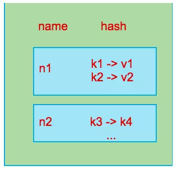
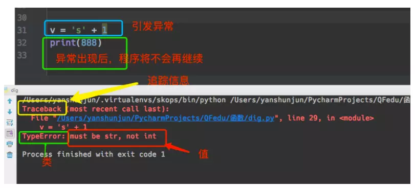

## 十九、Python3 操作数据库

### 1、Python3 操作 MySQL

#### 1、基本介绍

- Python3 操作 MySQL 数据库 可以使用的模块是 `pymysql` 和 `MySQLdb`。

- 这个两个模块都是通过自己的 API 执行原生的 SQL 语句实现的。

- MySQLdb 是最早出现的一个操作 MySQL 数据库的模块，核心由C语言编写，接口精炼，性能最棒，缺点是环境依赖较多，安装稍复杂，近两年已停止更新，且只支持Python2.x，不支持Python3.x。

- `pymysql` 为替代 `MySQLdb` 而生，纯 `Python` 实现，API 的接口与 `MySQLdb` 完全兼容，安装方便，支持Python3。

- 2020 已经离我们很近了，所以，我们这里只聊 `pymysql`

#### 2、 安装包 `pymysql`

pymysql是Python中操作MySQL的模块(Linux 机器)

```shell
pip3 install pymysql
```

#### 3、 基本操作

##### 1、创建表

```python
import pymysql 
创建连接
conn = pymysql.connect(host='172.16.153.10',
                       port=3306,
                       user='root',
                       passwd='123', 
                       db='shark_db',
                       charset='utf8mb4')
获取游标对象
cursor = conn.cursor()
定义 sql 语句
create_table_sql = """create table test1
 (id int auto_increment primary key, 
  name varchar(10) not null, 
  age int not null)"""

执行 sql 语句
cursor.execute(create_table_sql)

提交
conn.commit()

关闭游标对象
cursor.close()

关闭连接对象
conn.close()
```

##### 2、插入数据

**一次插入一条数据**

```python
一次插入一条数据, 并且使用变量占位符
insert_data_sql = "insert into t1(name, age) values(%s, %s);"
row = cursor.execute(insert_data_sql, ('shark', 18))
conn.commit()
cursor.close()
conn.close()
```

**一次插入多条数据**

```python
定义插入数据的语句
many_sql = "insert into t1 (name, age) values(%s, %s)"

一次插入多条数据
row = cursor.executemany(many_sql, [('shark1', 18),('xiguatian', 20),('qf', 8)])

conn.commit()
cursor.close()
conn.close()
```

##### 3、查询数据

###### 1、**获取到的数据是元组类型**

```python
定义一个查询语句
query_sql = "select id,name,age from t1 where name=%s;"

执行查询语句，并且返回得到结果的行数
row_nums = cursor.execute(query_sql, ('shark2'))

"""
获取到数据结果集具有迭代器的特性:
1. 可以通过索引取值，可以切片
2. 结果集中的数据每次取出一条就少一条
"""

获取数据中的第一条
one_data = cursor.fetchone()

获取数据中的指定数量的条目
many_data = cursor.fetchmany(2)

获取数据中剩余的全部数据
all_data = cursor.fetchall()

cursor.close()
conn.close()
print(row_nums)
print(one_data)
print(many_data)
print(all_data)
```

###### 2、**获取到的数据是字典类型的**

```python
游标设置为字典类型
cursor = conn.cursor(cursor=pymysql.cursors.DictCursor)

query_sql = "select id,name,age from t1 where name=%s;"

row_nums = cursor.execute(query_sql, ('shark2'))

获取结果的操作和之前的一样
result = cursor.fetchone()
conn.commit()
cursor.close()
conn.close()

print(result)
```

#### 4、应该加入异常处理

```python
import pymysql
  
# 创建连接
conn = pymysql.connect(host='172.16.153.10',
                       port=3306,
                       user='root',
                       passwd='123', 
                       db='shark_db')

# 创建游标
cursor = conn.cursor()
 
try:
    cursor.executemany("INSERT INTO para5(name,age) VALUES(%s,%s);", [('次牛444', '12'), ("次牛2", '11'), ('次牛3', '10')])
    conn.commit()
except Exception as e:
    # 如果执行sql语句出现问题，则执行回滚操作
    conn.rollback()
    print(e)
finally:
    # 不论try中的代码是否抛出异常，
    # 这里都会执行关闭游标和数据库连接
    cursor.close()
    conn.close()
```

#### 5、 获取新增数据的自增 ID

```python
# 先连接
cursor = conn.cursor()
cursor.executemany("insert into student(name,age, phone)values(%s,%s, %s)",
                   [ ("superman5110",18, '13295686769')]   )
conn.commit()
cursor.close()
conn.close()
  
# 获取最新自增ID
new_id = cursor.lastrowid
```

#### 6、操作存储过程(扩展)

**无参数存储过程**

```
cursor.callproc('p1')  #等价于cursor.execute("call p1()")
```

**有参存储过程**

```python
cursor.callproc('p2', args=(1, 22, 3, 4))

#获取执行完存储的参数,参数@开头
cursor.execute("select @p2,@_p2_1,@_p2_2,@_p2_3")  #{'@_p2_1': 22, '@p2': None, '@_p2_2': 103, '@_p2_3': 24}


row_1 = cursor.fetchone()
```

### 2、Python3 操作 Redis

#### 1、简单介绍

redis是一个key-value存储系统，和Memcached类似。它支持存储的value类型相对更多，包括string(字符串)、list(链表、set(集合)、zset(sorted set --有序集合)和hash（哈希类型）。

这些数据类型都支持push/pop、add/remove及取交集并集和差集及更丰富的操作，而且这些操作都是原子性的。在此基础上，redis支持各种不同方式的排序。

与memcached一样，为了保证效率，数据都是缓存在内存中。区别的是redis会周期性的把更新的数据写入磁盘或者把修改操作写入追加的记录文件，并且在此基础上实现了master-slave(主从)同步。

```
1. 使用Redis有哪些好处？
(1) 速度快，因为数据存在内存中，类似于HashMap，HashMap的优势就是查找和操作的时间复杂度都是O(1)
(2) 支持丰富数据类型，支持string，list，set，sorted set，hash
(3) 支持事务，操作都是原子性，所谓的原子性就是对数据的更改要么全部执行，要么全部不执行
(4) 丰富的特性：可用于缓存，消息，按key设置过期时间，过期后将会自动删除
```

#### 2、安装 redis 软件

```shell
yum install redis      #需要epel源
systemctl start redis
```

**命令列表**

```shell
redis-server                # Redis 服务器
redis-cli                   # Redis 自带的客户端
redis-benchmark             # Redis 性能测试工具
redis-check-aof             # AOF 文件修复工具
```

**Redis 默认监听 6379 端口**

#### 3、Redis 命令

Redis 命令用于在 redis 服务上执行操作。

要在 redis 服务上执行命令需要一个 redis 客户端。Redis 客户端在我们之前下载的的 redis 的安装包中。

语法

Redis 客户端的基本语法为：

```
$ redis-cli
```

以下实例讲解了如何启动 redis 客户端：

启动 redis 客户端，打开终端并输入命令 **redis-cli**。该命令会连接本地的 redis 服务。

```
$redis-cli
redis 127.0.0.1:6379>
redis 127.0.0.1:6379> PING

PONG
```

在以上实例中我们连接到本地的 redis 服务并执行 **PING** 命令，该命令用于检测 redis 服务是否启动。

------

##### 在远程服务上执行命令

如果需要在远程 redis 服务上执行命令，同样我们使用的也是 **redis-cli** 命令。

语法

```
$ redis-cli -h host -p port -a password
```

以下实例演示了如何连接到主机为 127.0.0.1，端口为 6379 ，密码为 mypass 的 redis 服务上。

```
$redis-cli -h 127.0.0.1 -p 6379 -a "mypass"
redis 127.0.0.1:6379>
redis 127.0.0.1:6379> PING

PONG
```

#### 4、Redis 数据类型

Redis支持五种数据类型：string（字符串），hash（哈希），list（列表），set（集合）及zset(sorted set：有序集合)。

------

##### 1、String（字符串）

string 是 redis 最基本的类型，你可以理解成与 Memcached 一模一样的类型，一个 key 对应一个 value。

string 类型是二进制安全的。意思是 redis 的 string 可以包含任何数据。比如jpg图片或者序列化的对象。

string 类型是 Redis 最基本的数据类型，string 类型的值最大能存储 512MB。

```
redis 127.0.0.1:6379> SET name "qianfeng"
OK
redis 127.0.0.1:6379> GET name
"qianfeng"
```

在以上实例中我们使用了 Redis 的 **SET** 和 **GET** 命令。键为 name，对应的值为 **qianfeng**。

**注意：**一个键最大能存储512MB。

------

##### 2、Hash（哈希）

Redis hash 是一个键值(key=>value)对集合。

Redis hash 是一个 string 类型的 field 和 value 的映射表，hash 特别适合用于存储对象。

**DEL qianfeng** 用于删除前面测试用过的 key，不然会报错：**(error) WRONGTYPE Operation against a key holding the wrong kind of value**

```
redis 127.0.0.1:6379> DEL qianfeng
redis 127.0.0.1:6379> HMSET myhash field1 "Hello" field2 "World"
"OK"
redis 127.0.0.1:6379> HGET myhash field1
"Hello"
redis 127.0.0.1:6379> HGET myhash field2
"World"
```

实例中我们使用了 Redis **HMSET, HGET** 命令，**HMSET** 设置了两个 **field=>value** 对, HGET 获取对应 **field** 对应的 **value**。

每个 hash 可以存储 2**32-1 键值对（40多亿）。

##### 3、List（列表）

Redis 列表是简单的字符串列表，按照插入顺序排序。你可以添加一个元素到列表的头部（左边）或者尾部（右边）。

```
redis 127.0.0.1:6379> lpush qianfeng redis
(integer) 1
redis 127.0.0.1:6379> lpush qianfeng mongodb
(integer) 2
redis 127.0.0.1:6379> lpush qianfeng rabitmq
(integer) 3
redis 127.0.0.1:6379> lrange qianfeng 0 10
1) "rabitmq"
2) "mongodb"
3) "redis"
redis 127.0.0.1:6379>
```

在以上实例中我们使用了 **LPUSH** 将三个值插入了名为 **qianfeng** 的列表当中。

列表最多可存储 232 - 1 元素 (4294967295, 每个列表可存储40多亿)。

##### 4、Set（集合）

Redis的Set是string类型的无序集合。

集合是通过哈希表实现的，所以添加，删除，查找的复杂度都是0(1)。

###### 1、sadd 命令

添加一个 string 元素到 key 对应的 set 集合中，成功返回1，如果元素已经在集合中返回 0，如果 key 对应的 set 不存在则返回错误。

```
sadd key member
```

```
redis 127.0.0.1:6379> sadd qianfeng1 redis
(integer) 1
redis 127.0.0.1:6379> sadd qianfeng1 mongodb
(integer) 1
redis 127.0.0.1:6379> sadd qianfeng1 rabitmq
(integer) 1
redis 127.0.0.1:6379> sadd qianfeng1 rabitmq
(integer) 0
redis 127.0.0.1:6379> smembers qianfeng1

1) "redis"
2) "rabitmq"
3) "mongodb"
```

**注意：**以上实例中 rabitmq 添加了两次，但根据集合内元素的唯一性，第二次插入的元素将被忽略。

集合中最大的成员数为 2**32 - 1(4294967295, 每个集合可存储40多亿个成员)。

##### 5、zset(sorted set：有序集合)

Redis 有序集合和集合一样也是string类型元素的集合,且不允许重复的成员。

不同的是每个元素都会关联一个double类型的分数。redis正是通过分数来为集合中的成员进行从小到大的排序。

有序集合的成员是唯一的,但分数(score)却可以重复。

集合是通过哈希表实现的，所以添加，删除，查找的复杂度都是O(1)。 集合中最大的成员数为 232 - 1 (4294967295, 每个集合可存储40多亿个成员)。。

```
double 和 float 的区别是 double精度高，有效数字16位，float精度7位。但double消耗内存是float的两倍，double的运算速度比float慢得多
```

###### 1、zadd 命令

添加元素到集合，元素在集合中存在则更新对应score

```
zadd key score member 
```

```redis
redis 127.0.0.1:6379> ZADD qianfengkey 1 redis
(integer) 1
redis 127.0.0.1:6379> ZADD qianfengkey 2 mongodb
(integer) 1
redis 127.0.0.1:6379> ZADD qianfengkey 3 mysql
(integer) 1
redis 127.0.0.1:6379> ZADD qianfengkey 3 mysql
(integer) 0
redis 127.0.0.1:6379> ZADD qianfengkey 4 mysql
(integer) 0
redis 127.0.0.1:6379> ZRANGE qianfengkey 0 10 WITHSCORES

1) "redis"
2) "1"
3) "mongodb"
4) "2"
5) "mysql"
6) "4"
```

在以上实例中我们通过命令 **ZADD** 向 redis 的有序集合中添加了三个值并关联上分数。

#### 5、Python 操作 Redis

所见即所得的东西，讲一部分，其他按照笔记看。不要求都掌握。

##### 1、安装包

```shell
pip3 install redis
```

##### 2、连接

```python
In [1]: import redis

In [2]: r = redis.Redis(host='10.18.42.174', port=6379)

In [3]: r.set("QF", "www.qfedu.com")
Out[3]: True
 
In [4]: r.get("QF")
Out[4]: b'www.qfedu.com'

In [5]: ret = r.get("QF")
    
In [6]: ret.decode()
Out[6]: 'www.qfedu.com'
```

##### 3、连接池

redis-py使用connection pool来管理对一个redis server的所有连接，避免每次建立、释放连接的开销。

默认，每个Redis实例都会维护一个自己的连接池。

可以直接建立一个连接池，然后作为参数传给Redis，这样就可以实现多个 Redis 实例共享一个连接池

```python
In [12]: pool = redis.ConnectionPool(host='172.16.153.134', port=6379)

In [13]: rs = redis.Redis(connection_pool=pool)

In [14]: rs.set("foo", "bar")
Out[14]: True

In [15]: rs.get("foo")
Out[15]: b'bar'
```

##### 4、基本操作

- ##### **String 操作**

  redis中的 String 在内存中按照一个name对应一个value来存储

```python
set(name, value, ex=None, px=None, nx=False, xx=False)

set() 
    """
     在 Redis 中设置值，默认，不存在则创建，存在则修改
       参数：
             ex，过期时间（秒）
             px，过期时间（毫秒）
             nx，假如设置为True，则只有 name 不存在时，当前 set 操作才执行
             xx，假如设置为True，则只有 name 存在时，当前 set 操作才执行
     """
 
setnx(name, value)

  # 设置值，只有name不存在时，执行设置操作（添加）
    
setex(name, time, value)

"""
 设置值
 参数：
     time，过期时间（数字秒）
"""

psetex(name, time_ms, value)

"""
 设置值
 参数：
     time_ms，过期时间（数字毫秒）
"""

mset(*args, **kwargs)

"""
批量设置值：
    mset(QF='www.qfedu.com', yangge='杨哥')
    或
    mget({'k1': 'v1', 'k2': 'v2'})
"""

get(name)

    # 获取值
    
mget(keys, *args)
"""
批量获取：
    mget('QF', 'foo')
    或
    mget(['QF', 'foo'])
"""


getset(name, value)

# 设置新值并获取原来的值

getrange(key, start, end)

# 以字节的方式获取一部分值(一个汉字等于三个字节)

setrange(name, offset, value)
"""
修改字符串内容，从指定字符串索引开始向后替换（新值太长时，则向后添加）
参数：
   offset  字符串的索引，字节方式
"""

incr(self, name, amount=1)

"""
 自增 name对应的值，当name不存在时，则创建 name＝amount，否则，则自增。
 
 参数：
     name,Redis的name
     amount,自增数（必须是整数）
"""

decr(self, name, amount=1)
# 自减

append(key, value)

# 在redis name对应的值后面追加内容
```

- ##### **Hash 操作**

 

```python
hset(name, key, value)
#*************************
In [20]: rs.hset("hs1","k1", "v1")
Out[20]: 0

#*************************

"""
 name 对应的 hash 中设置一个键值对（不存在，则创建；否则，修改）
 
 参数：
     name，redis hash的name
     key，name对应的hash中的key
     value，name对应的hash中的value
 
 注意：
    # hsetnx(name, key, value),当name对应的hash中不存在当前key时则创建（相当于添加）
"""

hmset(name, mapping)
#*************************
In [6]: rs.hmset('hs1', {'k1':'v1', 'k2': 'v2'})
Out[6]: True
#*************************

"""
在name对应的hash中批量设置键值对，没有的 key 就创建，已存在的 key 修改
 
 参数：
     mapping，字典，栗子：{'k1':'v1', 'k2': 'v2'}
"""
 
hget(name,key)
#*************************
In [8]: rs.hget('hs1','k1')
Out[8]: b'v1'
#*************************

# 在name对应的hash中获取根据key获取value

hmget(name, keys, *args)
"""
 在name对应的hash中获取多个key的值
 
 参数：
     name，reids对应的name
     keys，要获取key集合，栗子：['k1', 'k2', 'k3']
     *args，要获取的key，栗子：k1,k2,k3
 
 栗子：
     r.mget('xx', ['k1', 'k2'])
     或
     r.hmget('xx', 'k1', 'k2')
"""
    
################### 下面的自己搞 ########################
hgetall(name)
# 获取name对应hash的所有键值

hlen(name)
# 获取name对应的hash中键值对的个数

hkeys(name)
# 获取name对应的hash中所有的key的值

hvals(name)
# 获取name对应的hash中所有的value的值

hexists(name, key)
# 检查name对应的hash是否存在当前传入的key

hdel(name,*keys)
# 将name对应的hash中指定key的键值对删除

hincrby(name, key, amount=1)
"""
 自增name对应的hash中的指定key的值，不存在则创建key=amount
 参数：
     name，redis中的name
     key， hash对应的key
     amount，自增数（整数）
"""

hincrbyfloat(name, key, amount=1.0)
"""
 自增name对应的hash中的指定key的值，不存在则创建key=amount
 
 参数：
     name，redis中的name
     key， hash对应的key
     amount，自增数（浮点数）
"""

 # 更多 http://redisdoc.com/key/scan.html#scan
```

- ##### **List 操作**

```python
lpush(name,values)
"""
 在name对应的list中添加元素，每个新的元素都添加到列表的最左边
 
 栗子：
     r.lpush('oo', 11,22,33)
     保存顺序为: 33,22,11
 
 扩展：
     rpush(name, values) 表示从右向左操作
"""

lpushx(name,value)
"""
 在name对应的list中添加元素，只有name已经存在时，值添加到列表的最左边
 
 更多：
     rpushx(name, value) 表示从右向左操作
"""

llen(name)
# name对应的list元素的个数

linsert(name, where, refvalue, value))
"""
 在name对应的列表的某一个值前或后插入一个新值
 
 参数：
     name，redis的name
     where，BEFORE或AFTER
     refvalue，标杆值，即：在它前后插入数据
     value，要插入的数据
"""

r.lset(name, index, value)
"""
 对name对应的list中的某一个索引位置重新赋值
 
 参数：
     name，redis的name
     index，list的索引位置
     value，要设置的值
"""

r.lrem(name, value, num)
"""
 在name对应的list中删除指定的值
 
 参数：
     name，redis的name
     value，要删除的值
     num，  num=0，删除列表中所有的指定值；
            num=2,从前到后，删除2个；
            num=-2,从后向前，删除2个
"""

lpop(name)
"""
 在name对应的列表的左侧获取第一个元素并在列表中移除，返回值则是第一个元素
 
 扩展：
    # rpop(name) 表示从右向左操作
"""

lindex(name, index)
"""
在name对应的列表中根据索引获取列表元素
lrange(name, start, end)

 在name对应的列表分片获取数据
 参数：
     name，redis的name
     start，索引的起始位置
     end，索引结束位置
"""

ltrim(name, start, end)
"""
 在name对应的列表中移除没有在start-end索引之间的值
 参数：
     name，redis的name
     start，索引的起始位置
     end，索引结束位置
"""

rpoplpush(src, dst)
"""
 从一个列表取出最右边的元素，同时将其添加至另一个列表的最左边
 参数：
     src，要取数据的列表的name
     dst，要添加数据的列表的name
"""

blpop(keys, timeout)
"""
 将多个列表排列，按照从左到右去pop对应列表的元素
 
 参数：
     keys，redis的name的集合
     timeout，超时时间，当元素所有列表的元素获取完之后，阻塞等待列表内有数据的时间（秒）, 0 表示永远阻塞
 
 扩展：
     r.brpop(keys, timeout)，从右向左获取数据
"""

brpoplpush(src, dst, timeout=0)
"""
 从一个列表的右侧移除一个元素并将其添加到另一个列表的左侧
 
 参数：
     src，取出并要移除元素的列表对应的name
     dst，要插入元素的列表对应的name
     timeout，当src对应的列表中没有数据时，阻塞等待其有数据的超时时间（秒），0 表示永远阻塞
"""


#########   自定义增量迭代 ######### 
"""
 由于redis类库中没有提供对列表元素的增量迭代，假如想要循环name对应的列表的所有元素，那么就需要：
     1、获取name对应的所有列表
     2、循环列表
 但是，假如列表非常大，那么就有可能在第一步时就将程序的内容撑爆，所有有必要自定义一个增量迭代的功能：
"""

 
def list_iter(name):
    """
    自定义redis列表增量迭代
    :param name: redis中的name
    :return: yield 返回 列表元素
    """
    list_count = r.llen(name)
    for index in xrange(list_count):
        yield r.lindex(name, index)
 
# 使用
for item in list_iter('pp'):
    print(item)
```

- ##### **Set 操作**

  也是列表形式，但是其内的元素不允许重复

```python
sadd(name,values)
# name对应的集合中添加元素

scard(name)
# 获取name对应的集合中元素个数

sdiff(keys, *args)
# 差集，在第一个name对应的集合中且不在其他name对应的集合的元素集合

sdiffstore(dest, keys, *args)
# 获取第一个name对应的集合中且不在其他name对应的集合，再将其新加入到dest对应的集合中

sinter(keys, *args)
# 获取一个name对应集合的交集

sinterstore(dest, keys, *args)
# 获取多一个name对应集合的并集，再讲其加入到dest对应的集合中

sismember(name, value)
# 检查value是不是name对应的集合的成员

smembers(name)
# 获取name对应的集合的所有成员

smove(src, dst, value)
# 将某个成员从一个集合中移动到另外一个集合

spop(name)
# 从集合的右侧（尾部）移除一个成员，并将其返回

srandmember(name, numbers)
# 从name对应的集合中随机获取 numbers 个元素

srem(name, values)
# 在name对应的集合中删除某些值

sunion(keys, *args)
# 获取多一个name对应的集合的并集

sunionstore(dest,keys, *args)
# 获取多一个name对应的集合的并集，并将结果保存到dest对应的集合中
```

- ##### **Sort Set 操作**

  有序集合，在集合的基础上，为每元素排序；元素的排序需要根据另外一个值来进行比较，所以，对于有序集合，每一个元素有两个值，即：值和分数，分数专门用来做排序。

  ```python
  zadd(name, *args, **kwargs)
  """
   在 name 对应的有序集合中添加元素
   例如：
        zadd('something', 'n1', 1, 'n2', 2)
        或
        zadd('something', n1=11, n2=22)
  """
  
  zcard(name)
  # 获取name对应的有序集合元素的数量
  
  zcount(name, min, max)
  # 获取name对应的有序集合中分数 在 [min,max] 之间的个数
  
  zincrby(name, value, amount)
  # 自增name对应的有序集合的 name 对应的分数
  
  r.zrange( name, start, end, desc=False, withscores=False, score_cast_func=float)
  """
   按照索引范围获取name对应的有序集合的元素
   
   参数：
       name，redis的name
       start，有序集合索引起始位置（非分数）
       end，有序集合索引结束位置（非分数）
       desc，排序规则，默认按照分数从小到大排序
       withscores，是否获取元素的分数，默认只获取元素的值
       score_cast_func，对分数进行数据转换的函数
   
   更多：
       从大到小排序
       zrevrange(name, start, end, withscores=False, score_cast_func=float)
   
       按照分数范围获取name对应的有序集合的元素
       zrangebyscore(name, min, max, start=None, num=None, withscores=False, score_cast_func=float)
       从大到小排序
       zrevrangebyscore(name, max, min, start=None, num=None, withscores=False, score_cast_func=float)
  """
  
  zrank(name, value)
  """
   获取某个值在 name对应的有序集合中的排行（从 0 开始）
   
   更多：
       zrevrank(name, value)，从大到小排序
  """
  
  zrangebylex(name, min, max, start=None, num=None)
  """
   当有序集合的所有成员都具有相同的分值时，有序集合的元素会根据成员的 值 （lexicographical ordering）来进行排序，而这个命令则可以返回给定的有序集合键 key 中， 元素的值介于 min 和 max 之间的成员
   对集合中的每个成员进行逐个字节的对比（byte-by-byte compare）， 并按照从低到高的顺序， 返回排序后的集合成员。 如果两个字符串有一部分内容是相同的话， 那么命令会认为较长的字符串比较短的字符串要大
   
   参数：
       name，redis的name
       min，左区间（值）。 + 表示正无限； - 表示负无限； ( 表示开区间； [ 则表示闭区间
       min，右区间（值）
       start，对结果进行分片处理，索引位置
       num，对结果进行分片处理，索引后面的num个元素
   
   例子：
       ZADD myzset 0 aa 0 ba 0 ca 0 da 0 ea 0 fa 0 ga
       r.zrangebylex('myzset', "-", "[ca") 结果为：['aa', 'ba', 'ca']
   
   扩展：
       从大到小排序
       zrevrangebylex(name, max, min, start=None, num=None)
  """
  
  zrem(name, values)
  # 删除name对应的有序集合中值是values的成员
   
  # 如：zrem('zz', ['s1', 's2'])
  
  zremrangebyrank(name, min, max)
  # 根据排行范围删除
  
  zremrangebyscore(name, min, max)
  # 根据分数范围删除
  
  zremrangebylex(name, min, max)
  # 根据值返回删除
  
  zscore(name, value)
  # 获取name对应有序集合中 value 对应的分数
  
  zinterstore(dest, keys, aggregate=None)
  # 获取两个有序集合的交集，如果遇到相同值不同分数，则按照aggregate进行操作
  # aggregate的值为:  SUM  MIN  MAX
  
  zunionstore(dest, keys, aggregate=None)
  # 获取两个有序集合的并集，如果遇到相同值不同分数，则按照aggregate进行操作
  # aggregate的值为:  SUM  MIN  MAX
  ```

#### 6、发布和订阅

##### 1、**发布者**

```python
import redis
pool = redis.ConnectionPool(host='172.16.153.136',
                            port=6379,
                            max_connections=10)
conn = redis.Redis(connection_pool=pool)
conn.publish('fm101', '我要上头条')
```

##### **2、订阅者**

```python
import redis
pool = redis.ConnectionPool(host='172.16.153.136',
                            port=6379,
                            max_connections=10)
conn = redis.Redis(connection_pool=pool)
pub = conn.pubsub()
pub.subscribe('fm101')
while True:
    data = pub.parse_response()
    print(data)
```

#### 7、python链接redis操作（作业练习）

```python
redis-py提供两个类Redis和StrictRedis用于实现Redis的命令，StrictRedis用于实现大部分官方的命令，并使用官方的语法和命令，Redis是StrictRedis的子类，用于向后兼容旧版本的redis-py。
```

```python
import redis
#创建redis链接对象
r = redis.Redis(host='127.0.0.1',port=6379,decode_responses=True)
#存储键值对
r.set('site','www.qi.cn')
#获取值
print(r.get('site'))
#指定decode_responses为True，表示输出为字符串
red = redis.StrictRedis(host='127.0.0.1',port=6379,decode_responses=True)

#默认redis入库编码是utf-8，如果要修改的话，需要指明 charset 和 decode_responsers 为True
#test = redis.StrictRedis(host='localhost', port=6379, db=0, password=None, socket_timeout=None, connection_pool=None, charset='utf-8', errors='strict', decode_responses=False, unix_socket_path=None)
red.lpush('list1','mongdb','redis','mysql')
print(r.lrange('list1',0,-1))
print(r.llen('list1'))

#output:
www.qi.cn
['mysql', 'redis', 'mongdb']
3
```

连接池：

redis-py使用connection pool来管理对一个redis server的所有连接，避免每次建立、释放连接的开销。默认，每个Redis实例都会维护一个自己的连接池。可以直接建立一个连接池，然后作为参数Redis，这样就可以实现多个Redis实例共享一个连接池。

```python
import redis
#创建连接池
pool = redis.ConnectionPool(host='127.0.0.1',port=6379,decode_responses=True)
#创建链接对象
r=redis.Redis(connection_pool=pool)
#设置集合
r.sadd('set1','v1','v2','v3')
r.sadd('set1','v2')
#显示集合的值
print(r.smembers('set1'))

#使用strictRedis连接池
rs = redis.StrictRedis(connection_pool=pool)
r.lpush('l1','python','memcache','redis','mongodb')
print(r.lrange('l1',0,-1))


#output:
{'v3', 'v1', 'v2'}
['mongodb', 'redis', 'memcache', 'python']
```

##### （1）数据string操作

redis中的String在在内存中按照一个name对应一个value来存储的。

 set key value [EX seconds] [PX milliseconds] [NX|XX]

参数：

```python
ex，过期时间（秒）
px，过期时间（毫秒）
nx，如果设置为``True``，则只有name不存在时，当前``set``操作才执行
xx，如果设置为``True``，则只有name存在时，岗前``set``操作才执行
```

```python
import redis
#创建连接池
pool = redis.ConnectionPool(host='127.0.0.1',port=6379,decode_responses=True)
#创建链接对象
r=redis.Redis(connection_pool=pool)
r.set('test','dddddddddddd',ex=3,nx=True)
print(r.get('test'))
```

setnx(name,value)：设置值，只有在name不存在是才执行操作

setex(name,value,time)：设置值过期时间，单位为秒

psetex(name,time_ms,value)：设置值，过期时间为毫秒

mset(*args,**kwargs)：批量设置多个值

get(name)：获取值

getrange(key,start,end)：获取子序列,根据字节获取

setrange(name,oofset,value)：修改字符串内容，从指定字符串索引开始向后替换

```python
import redis
#创建连接池
pool = redis.ConnectionPool(host='127.0.0.1',port=6379,decode_responses=True)
#创建链接对象
r=redis.Redis(connection_pool=pool)
r.set('test','12345',nx=True)
r.setrange('test',0,'8888')
print(r.get('test'))
```

setbit(name,offset,value)：对name对应值的二进制表示的位进行操作

getbit(name,offset)：获取name对应的二进制位表示的值，只能是0或1

```python
import redis
r=redis.Redis(host='127.0.0.1',port=6379,decode_responses=True)
r.set('name','p')
print(r.get('name'))
#打印p,q对应的ascii码
print(ord('p'),ord('q'))
#打印ascii码对应的二进制
print(bin(ord('p')),bin(ord('q')))
print('修改前7位的值：',r.getbit('name','7'))
#设置二进制位的第7位为1，相当于移动ascii码位112为113对应的字符为q
r.setbit('name','7','1')
print('修改后7位的值：',r.getbit('name','7'))
print(r.get('name'))

#output：
p
112 113
0b1110000 0b1110001
修改前7位的值： 0
修改后7位的值： 1
q
```

strlen(name)：返回name对应值的字节长度，一个汉字3个字节

```python
import redis
r= redis.Redis(host='127.0.0.1',port=6379,decode_responses=True)
r.set('name','python')
print(r.strlen('name'))  #输出6个字节
```

incr(self,name,amount=1)：自增name对应的值，当name不存在时，则创建name=amount，否则自增

```python
import redis
r= redis.Redis(host='127.0.0.1',port=6379,decode_responses=True)
#r.set('name','python')
r.set('age','1')
print(r.incr('age','3')) #结果为4
```

decr(self,name,amount=1)：自减 name对应的值，当name不存在时，则创建name＝amount，否则，则自减

```python
import redis
r= redis.Redis(host='127.0.0.1',port=6379,decode_responses=True)

r.set('age','10')
print(r.decr('age','3'))  #输出为7
```

append(key,value)：在name对应的值后面追加内容

```python
import redis
r= redis.Redis(host='127.0.0.1',port=6379,decode_responses=True)
r.set('age','10')
print(r.get('age'))
print(r.append('age','11'))
print(r.get('age'))

#output：
10
4
1011
```

##### （2）hash操作

hset(name,key,value)：在name对应的hash中设置一个键值对，不存在则创建否则修改

```python
import redis
r= redis.Redis(host='127.0.0.1',port=6379,decode_responses=True)
r.hset('haset','python','3.5')
print(r.hget('haset','python'))
r.hset('haset','redis','1.8')
print(r.hgetall('haset'))

#output：
3.5
{'python': '3.5', 'redis': '1.8'}
```

hmset(name,mapping)：在name对应的hash中批量设置键值对

```python
import redis
r= redis.Redis(host='127.0.0.1',port=6379,decode_responses=True)
r.hmset('hashmore',{'k1':'v1','k2':'v2','k3':'v3'})
print(r.hmget('hashmore','k1','k2','k3'))
print(r.hgetall('hashmore'))
```

hget(name,key)：获取hash中的value

hmget(name,keys,*args)：获取过个hash的key的值

hgetall(name)：获取hash的所有键值对

hlen(name)：获取hash中键值对的个数

hkeys(name)：获取hash中所有keys的值

hvals(name):获取hash中所有value的值

hexists(name,key)：检查hash中是否存在key

```python
import redis
r= redis.Redis(host='127.0.0.1',port=6379,decode_responses=True)
r.hmset('hashmore',{'k1':'v1','k2':'v2','k3':'v3'})
print(r.hmget('hashmore','k1','k2','k3'))
print(r.hgetall('hashmore'))
print(r.hexists('hashmore','k2'))
print(r.hexists('hashmore','k4'))

#output：
['v1', 'v2', 'v3']
{'k1': 'v1', 'k2': 'v2', 'k3': 'v3'}
True
False
```

hdel(name,*key)：删除hash中的key

```python
import redis
r= redis.Redis(host='127.0.0.1',port=6379,decode_responses=True)
r.hmset('hashmore',{'k1':'v1','k2':'v2','k3':'v3'})
print(r.hgetall('hashmore'))
print(r.hdel('hashmore','k3'))
print(r.hgetall('hashmore'))

#output：
{'k3': 'v3', 'k2': 'v2', 'k1': 'v1'}
1
{'k2': 'v2', 'k1': 'v1'}
```

hincrby(name,key,amount=1)：自增hash中指定的key的值，不存在则创建key=amount

```python
import redis
r= redis.Redis(host='127.0.0.1',port=6379,decode_responses=True)
r.hmset('hashmore',{'k1':'1','k2':'2','k3':'3'})
print(r.hgetall('hashmore'))
r.hincrby('hashmore','k1','2')
print(r.hgetall('hashmore'))
```

hincrbyfloat(name,key,amount=1.0)：自增hash中指定的key的值，同上针对浮点数

hscan(name,cursor=0,match=None,count=None)：增量迭代获取hash中数据，cursor游标，match匹配key默认所有，count获取的个数。

```python
import redis
r= redis.Redis(host='127.0.0.1',port=6379,decode_responses=True)
r.hmset('hashmore',{'k1':'1','k2':'2','k3':'3','k4':'4'})
print(r.hgetall('hashmore'))
print(r.hscan('hashmore',cursor=2,match='k2',count=1))
print(r.hscan('hashmore',count=4))

#output：
```

{'k1': '1', 'k3': '3', 'k2': '2', 'k4': '4'}
(0, {'k2': '2'})
(0, {'k1': '1', 'k3': '3', 'k2': '2', 'k4': '4'})

hscan_iter(name,match=None,count=None)：利用yield封装hscan创建生成器，实现分批获取数据

```python
import redis
r= redis.Redis(host='127.0.0.1',port=6379,decode_responses=True)
r.hmset('hashmore',{'k1':'1','k2':'2','k3':'3','k4':'4','k5':'5','k6':'6','k7':'7','k8':'8'})
oo = r.hscan_iter('hashmore')
print(next(oo))
print(next(oo))
print(next(oo))
print(next(oo))

#output:
('k2', '2')
('k7', '7')
('k8', '8')
('k5', '5')
```

##### （3）list操作

lpush(name,values)：在列表中添加元素，每个新元素都从左边开始添加

```python
import redis
r = redis.Redis(host='127.0.0.1',port=6379,decode_responses=True)
r.lpush('l3',1,2)
print(r.lrange('l3',0,-1))
r.lpush('l3','88')
print(r.lrange('l3',0,-1))

#output：
['2', '1']
['88', '2', '1']
```

lpushx(name,value)：在列表中添加元素，只有在name存在时才添加

```python
import redis
r = redis.Redis(host='127.0.0.1',port=6379,decode_responses=True)
r.lpushx('l4',1)
print(r.lrange('l4',0,-1))
r.lpush('l4',2)
r.lpushx('l4',1)
print(r.lrange('l4',0,-1))

#output:
[]
['1', '2']
```

llen(name)：name对应的list元素的长度

linsert(name,where,refvalue,value)：在name对应的列表的某个值前或后插入一个新值，where指定前或后(befor/after)，refvalue参考值即指定的元素，value要插入的值

```python
import redis
r = redis.Redis(host='127.0.0.1',port=6379,decode_responses=True)
r.lpush('num','1','2')
r.linsert('num','after','2','python')#在2后面添加python元素值
r.linsert('num','before','1','redis') #在1之前插入redis
print(r.lrange('num',0,-1))

#output:
['2', 'python', 'redis', '1']
```

lset(name,index,value)：对列表中的某个索引位的值修改

```python
import redis
r = redis.Redis(host='127.0.0.1',port=6379,decode_responses=True)
print(r.lrange('num',0,-1))
r.lset('num','0','hello')
print(r.lrange('num',0,-1))

#output：
['2', 'python', 'redis', '1']
['hello', 'python', 'redis', '1']
```

lrem(name,value,num)：在name对应的list中删除指定的值

```python
import redis
r = redis.Redis(host='127.0.0.1',port=6379,decode_responses=True)
print(r.lrange('num',0,-1))
r.lrem('num','1','2')   #2为num指定的值的个数,可以指定-2从后往前删除
print(r.lrange('num',0,-1))

#output:
['1', 'hello', 'python', 'redis', '1']
['hello', 'python', 'redis']
```

lpop(name)：在name对应的列表的左侧获取第一个元素并删除，并返回参数的元素

lindex(name,index)：在name对应的列表中根据索引获取列表元素

ltrim(name,start,end)：在name对应的列表中移除start到end之间的值

lrange(name,start,end)：列表分片获取数据

rpoplush(src,dst):获取源列表最后一个元素的值，并将它添加到目标列表中的最左边

blpop(keys,timeout)：将多个列表排列，按照从左到右去pop对应列表的元素

brpoplpush(src,dst,timeout=0)：从一个列表的右侧移除一个元素并将其添加到另一个列表的左侧

##### （4）set操作

sadd(name,values)：添加元素到集合

scard(name)：获取集合中元素的个数

sdiff(keys,*args)：在第一个集合中的元素且不在其他集合的元素的集合

```python
import redis
r = redis.Redis(host='127.0.0.1',port=6379,decode_responses=True)
r.sadd('s1',1,2,3)
r.sadd('s2',4,5,2)
r.sadd('s3',7,8,1)
print(r.sdiff('s1','s2','s3'))

#output:
{'3'}
```

sdiffstore(dest,keys,*args)：在第一个keys中的集合元素且不在其他集合中的元素添加到dest新集合中

```python
import redis
r = redis.Redis(host='127.0.0.1',port=6379,decode_responses=True)
# r.sadd('s1',1,2,3)
# r.sadd('s2',4,5,2)
# r.sadd('s3',7,8,1)
print(r.sdiffstore('s4','s1','s2','s3'))
print(r.smembers('s4'))
```

sinter(keys,*args)：获取多个集合的并集

```python
import redis
r = redis.Redis(host='127.0.0.1',port=6379,decode_responses=True)
 r.sadd('s1',1,2,3)
 r.sadd('s2',4,5,2)
print(r.sinter('s1','s2'))

#output：
{'2'}
```

sinterstore(dest,keys,*args)：获取多个集合的并集并将结果加入到dest集合中

```python
import redis
r = redis.Redis(host='127.0.0.1',port=6379,decode_responses=True)
r.sadd('sex1',1,2,3,4)
r.sadd('sex2',4,5,2,7)
r.sadd('sex3',7,8,1,4,2)
r.sinterstore('sex4','sex1','sex2','sex3')
print(r.smembers('sex4'))

#output：
{'4', '2'}
```

sismember(name,value)：检查value是否在集合中

```python
import redis
r = redis.Redis(host='127.0.0.1',port=6379,decode_responses=True)
r.sadd('sex3',7,8,1,4,2)
print(r.sismember('sex3','8'))

#output：
True
```

smembers(name)：获取集合的所有成员

smove(src,dst,value)：将源集合中的某个成员移动到目标集合中

spop(name)：从集合的右侧（尾部）移除一个成员，并将其返回

srandmember(name,numbers)：从name对应的集合中随机获取 numbers 个元素

srem(name,values)：在name对应的集合中删除某些值

sunion(keys,*args)：并集显示多个集合元素

sunionstore(dest,keys,*args)：获取多一个name对应的集合的并集，并将结果保存到dest对应的集合中

sscan(name,cursor=0,match=None,count=None)：同字符串的操作，用于增量迭代分批获取元素，避免内存消耗太大

sscan_iter(name,match=None,count=None)：同字符串的操作，用于增量迭代分批获取元素，避免内存消耗太大

##### （5）有序集合操作

在集合的基础上，为每个元素排序，元素的排序需要根据另外一个值来进行比较，所以，对于有序集合，每一个元素有两个值，即：值和分数，分数专门用来做排序。

- zadd(name,*args,**kwargs)：在name对应的有序集合中添加元素
- zcard(name)：获取name对应的有序集合元素的数量
- zcount(name,min,max)：获取name对应的有序集合中分数 在 [min,max] 之间的个数
- zincrby(name,value,amount)：自增name对应的有序集合的 name 对应的分数
- r.zrange(name, start, end, desc=False, withscores=Flase, score_cast_func=float)：按照索引范围获取name对应的有序集合的元素
- zrank(name, value)：获取某个值在 name对应的有序集合中的排行（从 0 开始）
- zrangebylex(name, min, max, start=None, num=None)：当有序集合的所有成员都具有相同的分值时，有序集合的元素会根据成员的 值
- zrem(name, values)：删除name对应的有序集合中值是values的成员
- zremrangebyrank(name, min, max)： 根据排行范围删除
- zremrangebyscore(name, min, max)：根据分数范围删除
- zremrangebylex(name, min, max)：根据值返回删除
- zscore(name, values)：获取name对应有序集合中 value 对应的分数
- zinterstore(dest, keys, aggregate=None)：获取两个有序集合的交集，如果遇到相同值不同分数，则按照aggregate进行操作
- zunionstore(dest, keys, aggregate=None)：获取两个有序集合的并集，如果遇到相同值不同分数，则按照aggregate进行操作
- zscan(name, cursor=0, match=None, count=None, score_cast_func=float)：同字符串相似，相较于字符串新增score_cast_func，用来对分数进行操作
- zscan_iter(name, match=None, count=None,score_cast_func=float)：同字符串相似，相较于字符串新增score_cast_func，用来对分数进行操作

##### （6）其他操作

- delete(*name)：根据删除redis中的任意数据类型
- exists(name)：检测redis的name是否存在
- keys(pattern='*')：根据模型获取redis的name
- expire(name,time)：为某个redis的某个name设置超时时间
- rename(src, dst)：对redis的name重命名为
- move(name,db)：将redis的某个值移动到指定的db下
- randomkey()：随机获取一个redis的name（不删除）
- type(name)：获取name对应值的类型
- scan(cursor=0,match=None,count=None)：同字符串操作，用于增量迭代获取key
- scan_iter(match=None,count=None)：同字符串操作，用于增量迭代获取key

####  8、python对redis管道操作

redis默认在执行每次请求都会创建（连接池申请链接）和断开（归还连接池）一次连接操作，如果想要再一次请求中指定多个命令，则可以使用pipline实现一次请求指定多个命令，并且默认情况下一次pipline是原子性操作。

```python
import redis
 
pool = redis.ConnectionPool(host='0.0.0.0', port=6379)
 
r = redis.Redis(connection_pool=pool)
 
# pipe = r.pipeline(transaction=False)
pipe = r.pipeline(transaction=True)
 
r.set('name', 'python')
r.set('age', '18')
 
pipe.execute()
```

#### 9、python对redis发布与订阅

demo:

```python
#!/usr/bin/env python
# -*- coding:utf-8 -*-
import redis
class RedisHelper:
    '''类'''
    def __init__(self):
        #链接
        self.__conn = redis.Redis(host='0.0.0.0')
        self.chan_sub = 'fm104.5'
        #创建频道
        self.chan_pub = 'fm104.5'
 
    def public(self,info):
        '''公共的'''
        self.__conn.publish(self.chan_pub,info)
        '''将内容发布到频道'''
        return True
 
    def subscribe(self):
        pub = self.__conn.pubsub()
        pub.subscribe(self.chan_sub)
        pub.parse_response()
        return pub
```

发布者：

```python
#!/usr/bin/env python
# -*- coding:utf-8 -*- 
#导入模块
from redis_demo.demo import RedisHelper
#实例化
obj = RedisHelper()
#把内容发布到频道
obj.public('python')
```

订阅者：

```python
#!/usr/bin/env python
# -*- coding:utf-8 -*-
from redis_demo.demo import RedisHelper
 
obj = RedisHelper()
redis_sub = obj.subscribe()
 
while True:
    msg= redis_sub.parse_response()
    print (msg)
    print(type(msg))
```

运行方式：

　　　　先启动demo, 启动订阅者，启动发布者，订阅者接受消息。

## 二十、异常处理

### 1、什么是异常

异常就是程序运行时发生错误的信号（在程序出现错误时，则会产生一个异常，若程序没有处理它，则会抛出该异常，程序的运行也随之终止），所以，在编程过程中为了增加友好性，在程序出现bug时一般不会将错误信息显示给用户，而是现实一个提示的页面或者信息，在python中,错误触发的异常如下：

 

### 2、而错误分成以下两种情况

#### 1、语法错误

```python
#语法错误一
if
#语法错误二
def test:
    pass
#语法错误三
class Foo
    pass
#语法错误四
print(haha
```

#### 2、非语法错误

```python
# TypeError:int类型不可迭代
for i in 3:
    pass

# ValueError
inp=input(">>: ") # 输入 qf
int(inp)

# NameError
aaa

# IndexError
l=['yangge','aa']
l[3]

# KeyError
dic={'name':'yangge'}
dic['age']

# AttributeError
class Foo:
    pass
Foo.x

# ZeroDivisionError:无法完成计算
res1=1/0
```

### 3、异常的种类

在python中不同的异常可以用不同的类型（python3中统一了类与类型，类型即类）去标识，一个异常标识一种错误，python中的异常种类非常多，每个异常专门用于处理某一项异常

```python
# 试图访问一个对象没有的属性，比如foo.x，但是foo没有属性x
AttributeError 

# 输入/输出异常；基本上是无法打开文件
IOError 

# 无法导入模块或包；基本上是路径问题或名称错误
ImportError 

# 语法错误（的子类） ；代码没有正确对齐
IndentationError 

# 下标索引超出序列边界，比如当 li 只有三个元素，却试图访问 li[5]
IndexError 

# 试图访问字典里不存在的键
KeyError 

#  按了一下 Ctrl+C
KeyboardInterrupt

# 使用一个还未被赋予对象的变量
NameError 

# 无效语法，语法错误
SyntaxError 

# 传入对象类型不符合要求，如sum 函数需要的是 int，但你传入了 str
TypeError 

# 试图访问一个还未被设置的局部变量，基本上是由于另有一个同名的全局变量，导致你以为正在访问它
UnboundLocalError 
# 例如：
"""
x = 1
def func():
    x += 1
    return x

func()

UnboundLocalError: local variable 'x' referenced before assignment
# 局部变量 x 在赋值之前被引用
"""

# 传入一个调用者不期望的值，即使值的类型是正确的，比如 int('a')
ValueError 

#python中全部的异常类型
ArithmeticError
AssertionError
AttributeError
BaseException
BufferError
BytesWarning
DeprecationWarning
EnvironmentError
EOFError
Exception
FloatingPointError
FutureWarning
GeneratorExit
ImportError
ImportWarning
IndentationError
IndexError
IOError
KeyboardInterrupt
KeyError
LookupError
MemoryError
NameError
NotImplementedError
OSError
OverflowError
PendingDeprecationWarning
ReferenceError
RuntimeError
RuntimeWarning
StandardError
StopIteration
SyntaxError
SyntaxWarning
SystemError
SystemExit
TabError
TypeError
UnboundLocalError
UnicodeDecodeError
UnicodeEncodeError
UnicodeError
UnicodeTranslateError
UnicodeWarning
UserWarning
ValueError
Warning
ZeroDivisionError
```

### 4、异常处理

为了保证程序的健壮性与容错性，即在遇到错误时程序不会崩溃，我们需要对异常进行处理，

如果错误发生的条件是可预知的，我们需要用if进行处理：在错误发生之前进行预防

```python
def func(arg):
        if arg is int:
            arg += 1
        else:
            arg = int(arg)
            arg += 1
        return arg
```

**如果错误发生的条件是不可预知的，则需要用到try...except：在错误发生之后进行处理**

#### 1、基本语法为

```python
try:
    被检测的代码块
except 异常类型 as 异常信息变量名：
    try中一旦检测到异常，就执行这个位置的逻辑
```

**例子**

```python
def func(arg):
    try:
        arg +=1
    except TypeError as e:
        print(e)

func('杨哥')
```

#### 2、使用正确的异常类型

异常处理，只可以捕获到声明的异常种类和发生异常的种类相匹配的情况。
假如发生的异常类型和你指定捕获到异常不能匹配，就无法处理。

```python
x = '杨哥'
try:
    int(x)
except IndexError as e: # 未捕获到异常，程序直接报错
    print(e)
```

#### 3、处理异常的多分支操作

```python
x = '杨哥'
try:
    int(x)
except IndexError as e:
    print(e)
except KeyError as e:
    print(e)
except ValueError as e:
    print(e)
```

#### 4、万能异常 Exception

```python
x = '杨哥'
try:
    int(x)
except Exception as e:
    print(e)
```

#### 5、多分支异常与万能异常结合使用

假如对于不同种类的异常我们需要定制不同的处理逻辑，那就需要用到多分支了。 也可以在多分支的最后写一个Exception

```python
x = '杨哥'
try:
    x[3]
except IndexError as e:
    print(e)
except KeyError as e:
    print(e)
except ValueError as e:
    print(e)
except Exception as e:
    print(e)
```

#### 6、或者无论出现什么异常，都统一丢弃，或者使用同一段代码逻辑去处理

所有的异常! 只有一个Exception就足够了，这是不好的做法。

```python
try:
    print('a'[3])
except Exception as e:
    print(e)
```

#### 7、异常的其他结构

```python
x = '杨哥'
try:
    int(x)
except IndexError as e:
    print(e)
except KeyError as e:
    print(e)
except ValueError as e:
    print(e)
else:
    print('try内代码块没有异常则执行我')
finally:
    print('无论异常与否,都会执行该模块,通常是进行清理工作')

#如果try中没有异常，那么except部分将跳过，执行else中的语句。（前提是try里没有返回值）
#finally是无论是否有异常，最后都要做的一些事情。”（无论try里是否有返回值）
```

#### 8、主动触发异常

```python
try:
    raise TypeError('类型错误')
except Exception as e:
    print(e)

helper.py
def f1():
    print('f1')
    
index.py
import helper
if __name__ == '__main__'
	try:
        n = '1'
        n = int(n)
        ret = helper.f1()
        if ret:
            print('成功')
        else:
            raise Exception('调用失败')
    except Exception,e:
        print('出现错误')
        print(e)
        
```

### 5、更详细的异常信息输出(生产环境必备)

python中用于处理异常栈的模块是traceback模块，它提供了print_exception、format_exception等输出异常栈等常用的工具函数

```python
import traceback
print('start-->')
try:
    1 + 'a'
except TypeError as e:
    print(e)
    print('*' * 30)
    #traceback.print_exc()
    print(traceback.format_exc())
    print('*' * 20)
print('end')

# traceback.print_exc()跟traceback.format_exc()有什么区别呢？
# format_exc()返回字符串，print_exc()则直接给打印出来。
# 即traceback.print_exc()与print traceback.format_exc()效果是一样的。
# print_exc()还可以接受file参数直接写入到一个文件。比如
# traceback.print_exc(file=open('tb.txt','w+'))
# 写入到tb.txt文件去。(实现错误输出到日志的功能)
```